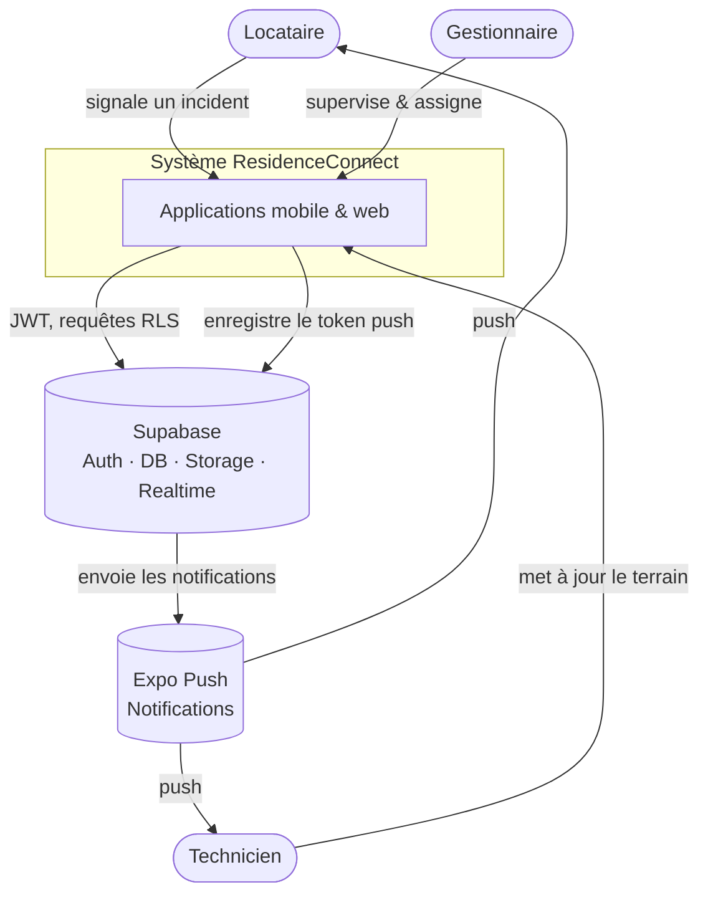
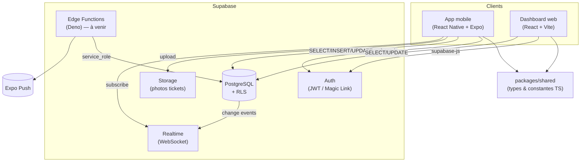
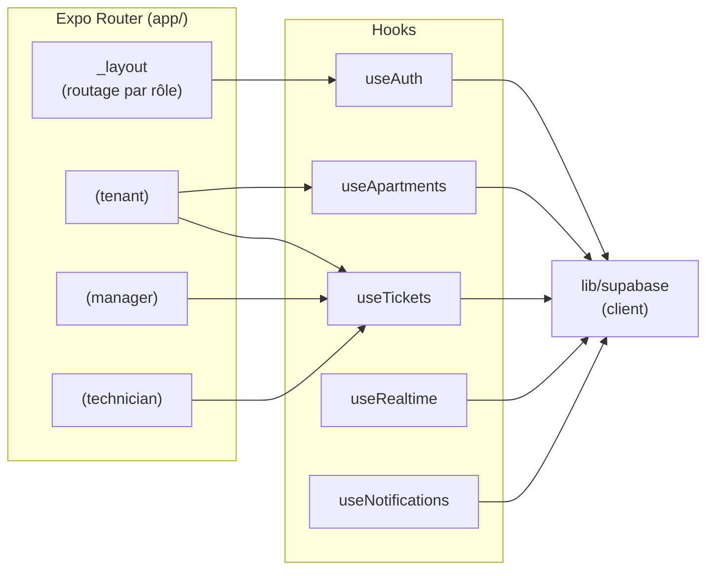
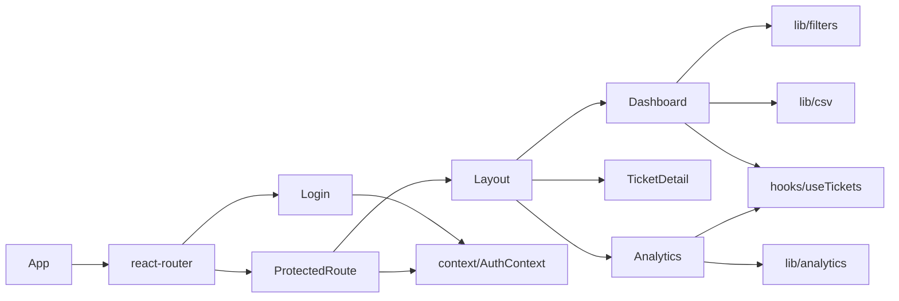

# Architecture — ResidenceConnect

Ce document décrit l'architecture selon le modèle **C4** (Context, Container,
Component) et justifie les principaux choix techniques.

## 1. Contexte (niveau 1)

Qui utilise le système et avec quels services externes il interagit.

## 2. Conteneurs (niveau 2)

Les unités déployables et leurs communications.

Chaque client dépend de `packages/shared` pour garantir des types identiques
de bout en bout (statuts, catégories, niveaux d'urgence, entités).

## 3. Composants (niveau 3) — App mobile

Organisation interne de l'application mobile.

Le composant racine `_layout` lit la session via `useAuth` et **force le
groupe de routes correspondant au rôle** (`tenant` → `(tenant)`, etc.), ce qui
évite l'affichage du mauvais espace au démarrage à froid.

## 4. Composants (niveau 3) — Dashboard web

La **logique métier pure** (`lib/filters`, `lib/analytics`, `lib/csv`,
`lib/format`) est isolée des composants et des appels réseau, ce qui la rend
testable unitairement sans backend.

## 5. Choix techniques

| Décision | Justification |
|----------|---------------|
| **Monorepo Turborepo + pnpm** | Partage de types entre mobile et web, cache de tâches, une seule source de vérité. |
| **Supabase** | Auth + PostgreSQL + Storage + Realtime + Edge managés : réduit l'infra à maintenir tout en gardant du SQL standard. |
| **RLS sur 100 % des tables** | La sécurité d'accès est appliquée **au plus près de la donnée** : même en cas de bug client, un locataire ne peut pas lire les tickets d'un autre. |
| **Fonctions `SECURITY DEFINER` + `search_path=''`** | Évitent la récursion des politiques sur `profiles` et protègent contre le détournement de schéma. |
| **Trigger `handle_new_user`** | Crée le profil automatiquement à l'inscription, sans insertion cliente ni contournement du RLS. |
| **Expo SDK 54** | Compatible avec l'app Expo Go publique (les SDK 56+ nécessitent un build custom). |
| **React 19 côté web** | Aligné sur la version du mobile dans le monorepo : évite les conflits de types `@types/react` en installation *hoisted*. |
| **TypeScript strict partout** | `strict: true`, zéro `any` : les erreurs sont détectées à la compilation. |

## 6. Sécurité — résumé

- Authentification par **JWT** géré par Supabase Auth.
- **RLS** activé sur toutes les tables ; les politiques s'appuient sur l'identité
  (`current_profile_id()`) et le rôle (`current_user_role()`) de l'appelant.
- Le **journal d'audit** (`ticket_history`) est en écriture seule : ni update ni
  delete côté client.
- Les secrets (URL, clés) sont fournis par variables d'environnement, jamais en
  dur ; seuls les fichiers `.env.example` (sans valeur) sont versionnés.

Détail du modèle de données et des politiques : voir
[database-schema.md](database-schema.md).
