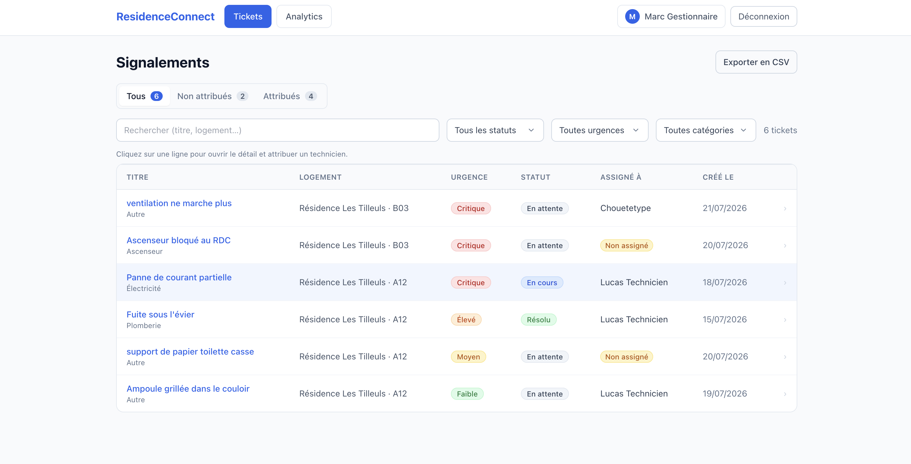
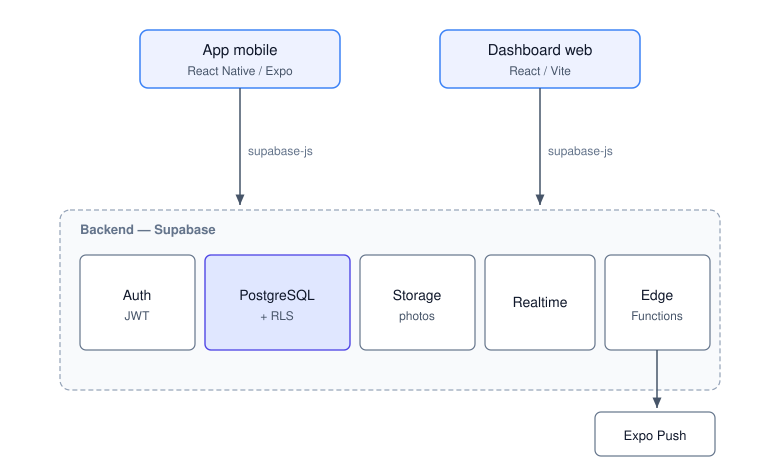
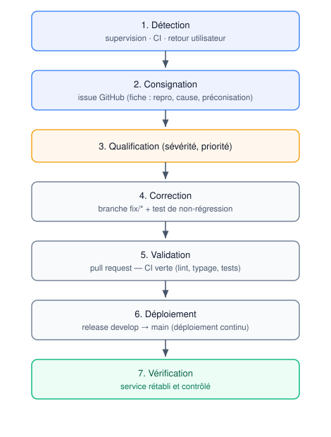
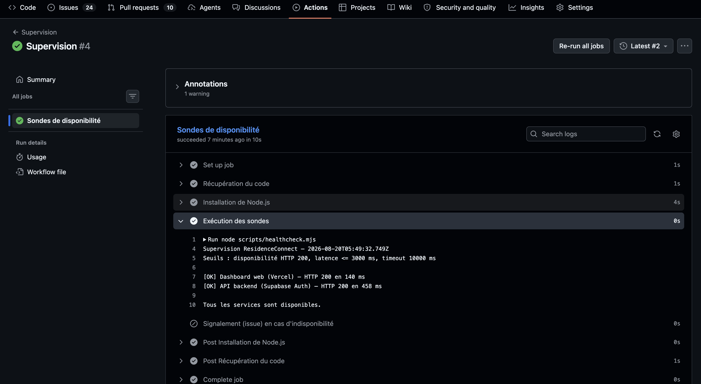
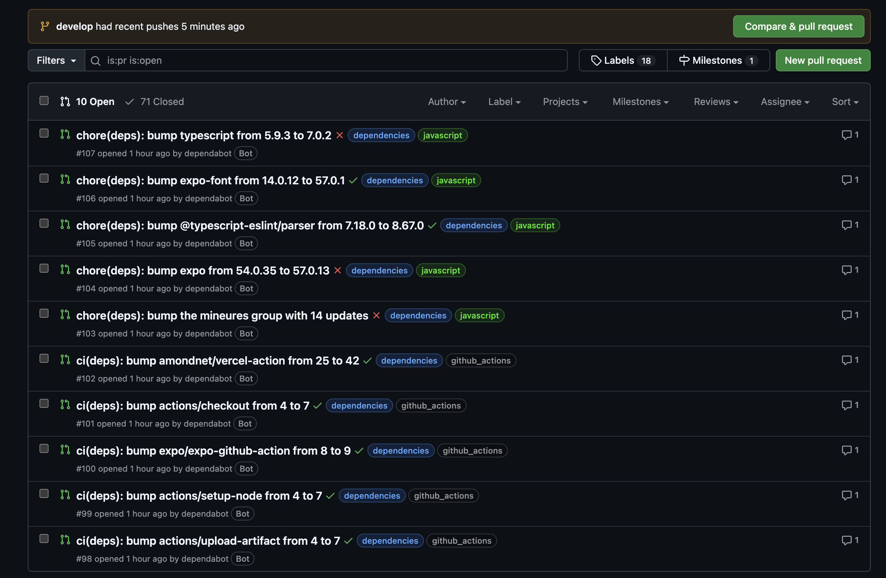
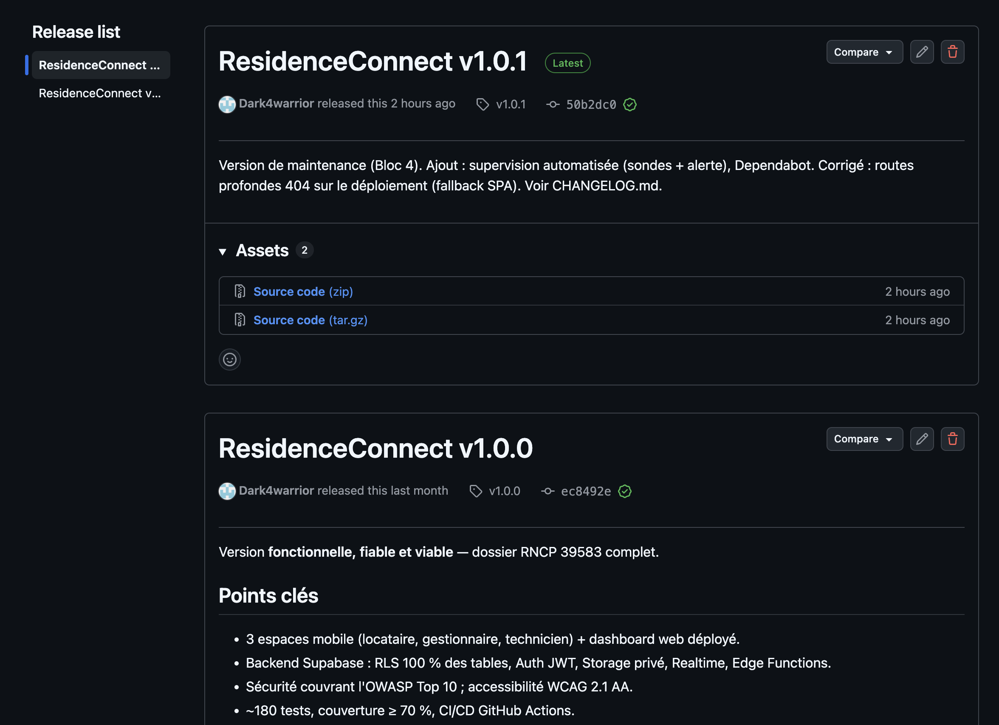

# ResidenceConnect — Dossier de projet

## Bloc 4 : Maintenir l'application logicielle en condition opérationnelle

**Candidat :** Gilchrist Steven LALEYE

**Titre visé :** Expert en développement logiciel (RNCP 39583, niveau 7)

**École :** Ynov Lyon

Ce dossier présente comment j'assure le maintien en condition opérationnelle de
**ResidenceConnect**, l'application de gestion d'incidents en résidence que j'ai
développée pendant ma formation : la **supervision** en production, le
**traitement des anomalies** et la **maintenance** du logiciel.

**Accès au projet**

- Code source : <https://github.com/Dark4warrior/ResidenceConnect>
- Application web déployée : <https://residence-connect-web.vercel.app>
- Application mobile (APK) : <https://github.com/Dark4warrior/ResidenceConnect/releases/tag/v1.0.0>
- Comptes de démonstration : gestionnaire `manager@residenceconnect.dev`, locataire `tenant@residenceconnect.dev`, technicien `technicien@residenceconnect.dev` — mot de passe `Demo1234!`

---

<div class="pb"></div>

# Sommaire

**Présentation de l'application ResidenceConnect**

**1. Mise à jour des dépendances**

- Périmètre, fréquence et type de mise à jour
- Évaluation de l'impact (exemple Dependabot)

**2. Système de supervision et d'alerte**

- Périmètre, indicateurs et sondes
- Seuils, modalité de signalement et réaction à une alerte
- Exécution et détection réelle d'une indisponibilité

**3. Gestion des anomalies**

- Processus de collecte, consignation et classification
- Fiche d'une anomalie réelle et son traitement
- Deuxième anomalie : indisponibilité du backend

**4. Journal des versions déployées**

**5. Maintenance**

- Recommandations d'amélioration argumentées
- Problème résolu en collaboration avec le support client

**Annexe A — Preuves (captures) · Conclusion**

---

---

<div class="pb"></div>

# Présentation de l'application ResidenceConnect

Comme ce dossier peut être lu indépendamment, je présente d'abord l'application
concernée avant d'aborder sa maintenance.

## Le besoin

ResidenceConnect répond à un besoin concret d'un **bailleur social** : gérer les
incidents signalés dans ses résidences (fuite d'eau, panne d'ascenseur, problème
électrique…). Ce suivi, souvent éclaté entre appels téléphoniques et e-mails, est
ici **centralisé** dans une seule application, de la déclaration jusqu'à la
résolution.

## Les trois profils d'utilisateurs

- **Locataire** (application mobile) — signale un incident depuis son téléphone,
  avec une photo, et suit son avancement.
- **Gestionnaire** (application web) — consulte tous les signalements sur un
  tableau de bord, les filtre, attribue un technicien, met à jour le statut et
  suit des indicateurs.
- **Technicien** (application mobile) — consulte les missions qui lui sont
  assignées et met à jour leur statut directement sur le terrain.

<p align="center"></p>

*Le tableau de bord du gestionnaire (web) : liste filtrable des signalements.*

## Les fonctionnalités principales

- Signalement d'un incident avec photo(s), catégorie et niveau d'urgence.
- Tableau de bord filtrable, attribution d'un technicien, changement de statut.
- **Suivi en temps réel** : le locataire voit l'avancement sans rafraîchir.
- **Journal d'audit** de chaque changement, notifications, export CSV, analytics.

## L'architecture technique

Le projet est un **monorepo** (pnpm + Turborepo) regroupant `apps/mobile`
(React Native / Expo), `apps/web` (React + Vite), `packages/shared` (types
partagés) et `supabase/`. Le backend est **Supabase** : base **PostgreSQL** avec
sécurité au niveau des lignes (RLS), authentification par jeton (**JWT**),
**stockage** des photos, **temps réel** et **fonctions serverless** (Edge
Functions).



## État en production

L'application est **déployée et exploitée** : le dashboard web sur Vercel,
l'application mobile distribuée en APK, et le backend sur Supabase. C'est cette
application **en production** que le présent dossier traite sous l'angle de la
**maintenance en condition opérationnelle**.

---

# 1. Mise à jour des dépendances

Pour garder l'application à jour et sûre sans y consacrer trop de temps, j'ai mis en place un processus **semi-automatique** de gestion des dépendances : l'outillage propose les mises à jour, et je garde la main sur ce qui est réellement intégré.

## 1. Périmètre concerné

Le monorepo regroupe plusieurs ensembles de dépendances, tous couverts :

- **`apps/web`** — React, Vite, Tailwind, supabase-js…
- **`apps/mobile`** — React Native, Expo SDK, expo-*, supabase-js…
- **`packages/shared`** — dépendances des types/constantes partagés.
- **Racine / outillage** — pnpm, Turborepo, ESLint, TypeScript, Vitest, Jest.
- **Actions GitHub** — les *actions* utilisées par les workflows CI/CD.

Les versions sont **verrouillées** par un unique `pnpm-lock.yaml` à la racine :
les installations sont reproductibles (`pnpm install --frozen-lockfile` en CI).

## 2. Fréquence

- **Automatique — hebdomadaire** : Dependabot (`.github/dependabot.yml`) inspecte
  chaque semaine les nouvelles versions des dépendances npm et des actions
  GitHub, et ouvre des *pull requests* de mise à jour.
- **Ponctuelle** : à l'occasion d'un correctif de sécurité signalé, ou d'un
  besoin fonctionnel.

## 3. Type : automatique **et** manuel

Le processus est **semi-automatique**, pour concilier fraîcheur et maîtrise :

1. **Automatique** — Dependabot ouvre les PR de montée de version (les mises à
   jour mineures et correctives sont **regroupées** en une seule PR pour limiter
   le bruit).
2. **Validation par la CI** — chaque PR déclenche `ci.yml` (lint, typage,
   tests + couverture). Une mise à jour qui casse quelque chose **ne peut pas
   être fusionnée**.
3. **Fusion manuelle** — la montée de version est **relue puis fusionnée** par le
   développeur. Les mises à jour **majeures** (risque de rupture) sont traitées
   au cas par cas.

## 4. Évaluation de l'impact et sécurité

- La **CI** mesure automatiquement l'impact d'une mise à jour (régression de
  test, erreur de typage) avant toute fusion.
- Contrainte spécifique mobile : **Expo SDK 54** est figé (compatibilité Expo
  Go) — les paquets `expo-*` sont alignés via `npx expo install --check`, et non
  montés arbitrairement.
- Les alertes de sécurité GitHub (Dependabot security) sont traitées **en
  priorité** (cf. `docs/plan-correction-bogues.md`).

### Exemple réel d'évaluation d'impact

À sa première exécution, Dependabot a ouvert une dizaine de *pull requests*
(cf. **Annexe A**). Elles ont été triées selon leur impact :

- **Acceptées** — les mises à jour **mineures et correctives** (regroupées en une
  PR), à faible risque, validées par la CI.
- **Écartées / reportées** — les montées **majeures** susceptibles de casser
  l'application : par exemple le passage d'**Expo 54 → 57** (incompatible avec la
  contrainte Expo Go du projet) ou de **TypeScript 5 → 7**. Ces PR sont
  **refusées** en connaissance de cause, illustrant l'**évaluation des impacts**
  avant toute intégration.

## 5. Synthèse

| Critère | Valeur |
| --- | --- |
| Périmètre | web, mobile, shared, outillage, actions GitHub |
| Fréquence | hebdomadaire (Dependabot) + ponctuelle (sécurité) |
| Type | automatique (ouverture des PR) + manuel (revue et fusion) |
| Garde-fou | CI bloquante (lint, typage, tests) sur chaque PR |

---

# 2. Système de supervision et d'alerte

Une fois l'application en production, j'avais besoin de savoir, en continu, si elle restait accessible aux utilisateurs. J'ai donc conçu un système de supervision volontairement simple, mais **réel et automatisé**, plutôt qu'une supervision décrite « sur le papier ».

## 1. Objectif et périmètre

L'objectif est de **détecter au plus vite toute indisponibilité** des services en
production, afin de rétablir le service rapidement. Le périmètre de supervision
couvre les deux composants dont dépend l'expérience utilisateur :

| Composant supervisé | Pourquoi | Impact si indisponible |
| --- | --- | --- |
| **Dashboard web** (Vercel) | Point d'entrée du gestionnaire | Le gestionnaire ne peut plus piloter les signalements |
| **API backend** (Supabase : Auth + PostgreSQL) | Sert **toutes** les apps (web ET mobile) | Plus aucune connexion ni lecture/écriture des données |

L'application mobile n'est pas sondée directement (elle s'installe sur
l'appareil), mais elle dépend du **même backend Supabase** : sa supervision est
donc couverte par la sonde backend.

## 2. Indicateurs de suivi

Pour chaque service, la supervision suit des indicateurs simples et parlants :

- **Disponibilité** : le service répond-il avec un code HTTP attendu (`200`) ?
- **Joignabilité** : le service est-il atteignable (pas de timeout / d'erreur
  réseau) ?
- **Temps de réponse (latence)** : le service répond-il assez vite ?

## 3. Sondes mises en place

La supervision est **automatisée et versionnée dans le dépôt** :

- **`scripts/healthcheck.mjs`** — exécute les sondes : une requête HTTP vers le
  dashboard web (`/login`) et une vers l'API Supabase (`/auth/v1/settings`),
  mesure le code de réponse et la latence, et sort en erreur si un seuil est
  dépassé.
- **`.github/workflows/monitoring.yml`** — planifie l'exécution des sondes
  **toutes les 30 minutes** (`cron: */30 * * * *`) et permet un déclenchement
  manuel (`workflow_dispatch`). GitHub Actions est gratuit et illimité sur un
  dépôt public.


Extrait de la définition des sondes (`scripts/healthcheck.mjs`) — chaque sonde a
son URL, son critère de disponibilité et la mesure de latence :

```js
const probes = [
  { name: 'Dashboard web (Vercel)', url: `${WEB_URL}/login`, okStatus: (s) => s === 200 },
  { name: 'API backend (Supabase Auth)', url: `${SUPABASE_URL}/auth/v1/settings`,
    headers: { apikey: SUPABASE_ANON_KEY }, okStatus: (s) => s === 200 },
];
```

Extrait de la planification (`.github/workflows/monitoring.yml`) :

```yaml
on:
  schedule:
    - cron: '*/30 * * * *' # toutes les 30 minutes
  workflow_dispatch: {}
```

## 4. Seuils d'alerte

Une sonde passe en **ALERTE** dès qu'un de ces seuils est franchi :

| Indicateur | Seuil |
| --- | --- |
| Disponibilité | code HTTP différent de `200` |
| Joignabilité | pas de réponse sous **10 s** (timeout) |
| Latence | temps de réponse **supérieur à 3 000 ms** |

Ces seuils sont paramétrables par variables d'environnement (`LATENCY_MS`, etc.).

## 5. Modalité de signalement

Quand au moins une sonde est en alerte, le script sort en **code non nul**, ce
qui **fait échouer le workflow**. Le signalement est alors double :

1. **Notification GitHub** — l'auteur du dépôt reçoit un e-mail automatique
   d'échec du workflow.
2. **Issue de signalement** — une étape `if: failure()` ouvre automatiquement une
   **issue** libellée `supervision`, contenant le lien vers les logs des sondes
   et l'action attendue.

Le signalement est ainsi **tracé** (issue) en plus d'être **poussé** (e-mail).
J'ai aussi prévu une **déduplication** : si une alerte est déjà ouverte, le
workflow n'en crée pas de nouvelle, pour éviter de multiplier les issues tant que
l'incident n'est pas résolu. Extrait du workflow :

```yaml
- name: Signalement (issue) en cas d'indisponibilité
  if: failure()
  run: |
    open=$(gh issue list --label supervision --state open --json number --jq 'length')
    if [ "$open" -gt 0 ]; then echo "Alerte déjà ouverte, pas de doublon."; exit 0; fi
    gh issue create --title "Supervision : indisponibilité détectée..." \
      --label supervision --body "Sonde en alerte. Logs : $RUN_URL"
```

### Matrice de supervision

| Indicateur | Sonde | Seuil | Signalement si dépassé |
| --- | --- | --- | --- |
| Disponibilité web | `GET /login` (Vercel) | HTTP 200 | e-mail + issue |
| Disponibilité backend | `GET /auth/v1/settings` (Supabase) | HTTP 200 | e-mail + issue |
| Joignabilité | toute sonde | réponse < 10 s | e-mail + issue |
| Latence | toute sonde | temps de réponse < 3 s | e-mail + issue |

### Procédure de réaction à une alerte

Le signalement ne sert à rien s'il n'est pas suivi d'une réaction. Quand je reçois
une alerte, j'applique la même démarche :

1. **Confirmer** — j'ouvre le run du workflow pour lire quelle sonde a échoué et
   pourquoi (code HTTP, timeout, latence).
2. **Localiser** — je distingue les deux cas typiques : le **dashboard web**
   (souci de déploiement Vercel) ou le **backend Supabase** (base en pause,
   quota, incident du fournisseur).
3. **Rétablir** — je relance le service concerné (par exemple, réactiver le
   projet Supabase) ou je corrige la configuration de déploiement.
4. **Vérifier** — je relance le workflow manuellement (`workflow_dispatch`) pour
   confirmer le retour au vert.
5. **Clôturer** — je ferme l'issue `supervision`, ce qui rouvre la voie à un
   prochain signalement en cas de nouvel incident.

C'est exactement le cycle que j'ai suivi lors de la mise en pause réelle de la
base (voir section suivante).

## 6. Exécution et vérification

**Exécution nominale** (services disponibles) — sortie d'un run réel du workflow :

```
Supervision ResidenceConnect — 2026-08-20T03:23:31Z
[OK] Dashboard web (Vercel) — HTTP 200 en 116 ms
[OK] API backend (Supabase Auth) — HTTP 200 en 703 ms
Tous les services sont disponibles.
```

**Détection réelle** — la sonde a effectivement remonté une indisponibilité du
backend lorsque le projet Supabase (offre gratuite) s'était **mis en pause**
après inactivité :

```
[OK]     Dashboard web (Vercel) — HTTP 200 en 656 ms
[ALERTE] API backend (Supabase Auth) — INJOIGNABLE (fetch failed)
1 sonde(s) en alerte — signalement déclenché.
```

Le service a ensuite été relancé, et les sondes suivantes sont repassées au vert
— illustrant le cycle complet **détection → signalement → rétablissement**.

**Vérification de la chaîne d'alerte** — le signalement a aussi été validé en
exécutant la sonde contre une URL volontairement injoignable (HTTP 404 →
`ALERTE`, sortie en erreur). En exécution planifiée, ce cas fait **échouer le
workflow** → notification GitHub à l'auteur **et** ouverture automatique d'une
issue `supervision`.

## 7. Outils complémentaires

- **Tableau de bord Supabase** : métriques intégrées (nombre de requêtes, taux
  d'erreur, connexions à la base) et **logs** consultables (Auth, API, Postgres),
  utiles pour l'analyse après une alerte.
- **GitHub Actions (CI)** : le workflow `ci.yml` supervise en continu la **santé
  du code** (lint, typage, tests) à chaque modification — une forme de
  supervision préventive complémentaire à la supervision d'exécution.

## 8. Évolutions possibles

- **Suivi d'erreurs applicatives** (Sentry) pour capturer les exceptions
  runtime côté client, au-delà de la simple disponibilité.
- **Historisation des mesures** (uptime, latence) pour suivre des tendances.

---

# 3. Gestion des anomalies : consignation, fiche et traitement

Quand une anomalie survient, je veux pouvoir la **retrouver**, **comprendre son origine** et la **corriger sans rien casser d'autre**. J'ai donc formalisé un processus, que j'illustre ensuite avec une anomalie réellement rencontrée après la mise en production.

## 1. Processus de collecte et de consignation (C4.2.1)

### 1.1 Sources de détection

| Source | Détail |
| --- | --- |
| **Supervision** | Les sondes planifiées (`monitoring.yml`) détectent les indisponibilités et ouvrent une issue automatiquement (cf. `docs/bloc4/supervision.md`). |
| **Intégration continue** | `ci.yml` échoue si le lint, le typage ou les tests régressent. |
| **Retours utilisateurs** | Signalements du gestionnaire / des utilisateurs / du jury. |
| **Revue de code** | Détection en revue de *pull request*. |

### 1.2 Outil de consignation

Les anomalies sont consignées comme **issues GitHub**, dans le même dépôt que le
code. C'est l'outil de collecte : il centralise, historise, et relie chaque
anomalie à sa correction (une issue est fermée par la *pull request* qui la
corrige, via `Closes #NN`). Un **label** qualifie la nature (`bug`, `supervision`,
`securité`) et un autre la **sévérité** (`bloquant`, `majeur`, `mineur`).

### 1.3 Gabarit de fiche de consignation

Chaque anomalie est décrite avec les informations **permettant de la reproduire
et de la corriger** :

| Champ | Contenu |
| --- | --- |
| Identifiant / titre | référence courte de l'anomalie |
| Date, environnement | quand et où (prod / préprod / dev) |
| Sévérité | bloquant / majeur / mineur |
| Description | symptôme observé |
| Étapes de reproduction | actions menant au bogue |
| Résultat observé vs attendu | l'écart constaté |
| Analyse (cause racine) | origine technique |
| Préconisation de correction | correctif envisagé |

### 1.4 Classification et priorité

Toutes les anomalies ne se valent pas : je les **qualifie** dès leur consignation
pour décider de l'ordre de traitement. La priorité combine la **sévérité** et le
**nombre d'utilisateurs impactés** ; toute anomalie touchant la **sécurité** est
traitée comme bloquante quelle que soit sa fréquence.

| Sévérité | Définition | Délai de traitement visé |
| --- | --- | --- |
| **Bloquante** | Empêche l'usage d'une fonction essentielle, ou faille de sécurité | Immédiat, avant toute autre livraison |
| **Majeure** | Fonction dégradée sans contournement simple | Dans l'itération courante |
| **Mineure** | Gêne légère avec contournement, ou défaut cosmétique | Planifiée, sans urgence |

L'anomalie présentée plus bas (404 sur les routes profondes) a ainsi été qualifiée
de **majeure** : l'application était inutilisable en accès direct à une URL, mais
la racine `/` restait accessible.

### 1.5 Cycle de traitement

De la détection au rétablissement, chaque anomalie suit le même cycle :



Ce processus est détaillé dans le plan de correction des bogues
(`docs/plan-correction-bogues.md`).

## 2. Fiche de consignation — anomalie réelle

Anomalie rencontrée **en production** au cours du projet.

| Champ | Contenu |
| --- | --- |
| **Titre** | Routes profondes en erreur 404 sur le dashboard déployé |
| **Date / environnement** | Juillet 2026 — **production** (déploiement Vercel) |
| **Sévérité** | **Majeure** (l'application est inutilisable en accès direct à une URL) |
| **Description** | Après déploiement sur Vercel, l'ouverture directe d'une route (ex. `/login`, `/tickets/:id`) renvoie une page **404 NOT_FOUND** de Vercel, au lieu de l'application. |
| **Étapes de reproduction** | 1. Ouvrir `https://residence-connect-web.vercel.app/login`. 2. Observer l'erreur 404. (La racine `/` fonctionnait, mais pas les sous-routes ni le rechargement d'une page.) |
| **Résultat observé** | 404 NOT_FOUND ; l'application ne se charge pas. |
| **Résultat attendu** | L'application se charge et affiche la page demandée. |
| **Analyse (cause racine)** | L'application est une **SPA** (React Router : le routage est côté client). Sur Vercel, le *Root Directory* du projet est `apps/web`, si bien que le `vercel.json` placé à la racine du dépôt **n'était pas lu**. Sans règle de réécriture, Vercel cherchait un fichier physique `/login` — inexistant — d'où le 404. |
| **Préconisation** | Ajouter un `vercel.json` **dans `apps/web/`** avec une réécriture SPA renvoyant toutes les routes vers `/index.html`. |

## 3. Traitement de l'anomalie (C4.2.2)

Le correctif a suivi le **processus d'intégration et de déploiement continu** :

1. **Branche** `fix/vercel-spa-url` depuis `develop`.
2. **Correctif** — ajout de `apps/web/vercel.json` :
   ```json
   {
     "rewrites": [{ "source": "/(.*)", "destination": "/index.html" }]
   }
   ```
   Toutes les routes sont désormais servies par `index.html`, laissant React
   Router gérer l'affichage côté client.
3. **Pull request** — relue, **CI verte** (lint, typage, tests) avant fusion.
4. **Intégration puis release** — fusion sur `develop`, puis *pull request* de
   release `develop → main`. Le *push* sur `main` **déclenche automatiquement le
   redéploiement Vercel** (cf. `docs/ci-cd.md`).
5. **Vérification** — après redéploiement, `https://residence-connect-web.vercel.app/login`
   renvoie de nouveau **HTTP 200** et l'application se charge normalement.

### Prévention de la régression

- Le correctif est **versionné** (`apps/web/vercel.json`) : le comportement est
  reproductible à chaque déploiement, l'anomalie ne peut pas réapparaître par
  simple reconfiguration.
- La **sonde de supervision** interroge précisément `/login` : une régression de
  ce type serait **détectée automatiquement** (cf. `docs/bloc4/supervision.md`).
- Pour les anomalies **de code**, la règle est d'accompagner tout correctif d'un
  **test de non-régression** reproduisant le bogue (cf.
  `docs/plan-correction-bogues.md`).

## 4. Deuxième anomalie : indisponibilité du backend

Cette seconde anomalie illustre le lien direct entre la **supervision**
(section 2) et la gestion des anomalies : c'est la sonde qui l'a détectée, sans
intervention humaine.

| Champ | Contenu |
| --- | --- |
| **Titre** | Indisponibilité du backend en production |
| **Date / environnement** | Août 2026 — **production** |
| **Sévérité** | **Bloquante** (plus aucune connexion, sur le web comme sur le mobile) |
| **Mode de détection** | **Automatique**, par la sonde de supervision : `API backend — INJOIGNABLE` |
| **Description** | Les requêtes vers Supabase échouent : impossible de se connecter ou de charger les données, quelle que soit l'application. |
| **Étapes de reproduction** | Ouvrir l'application déployée et tenter une connexion → échec ; la sonde de supervision renvoie une alerte. |
| **Analyse (cause racine)** | Le projet Supabase (offre gratuite) se met **en pause** après une période d'inactivité ; le service ne répond plus. |
| **Préconisation** | Réactiver le projet ; à terme, **fiabiliser le backend** (offre payante ou maintien en éveil) pour supprimer la cause. |

**Traitement.** J'ai réactivé le projet Supabase depuis son tableau de bord ; les
sondes de supervision sont repassées au vert dès l'exécution suivante, confirmant
le rétablissement.

Contrairement à la première anomalie, celle-ci **ne se corrige pas par du code**
mais par une **action d'exploitation** et une **décision d'infrastructure**. C'est
précisément ce qui la rend intéressante : elle montre qu'une partie de la
maintenance en condition opérationnelle relève de l'environnement d'exécution, et
elle alimente directement les **axes d'amélioration** présentés en section 5
(fiabiliser le backend).

---

# 4. Journal des versions déployées

Pour savoir à tout moment ce qui a été déployé et pourquoi, je tiens un **journal de version**. Il me sert autant à documenter les correctifs qu'à communiquer les évolutions.

## 1. Où et comment le journal est tenu

Le journal des versions est **tenu dans le dépôt** à deux niveaux, cohérents
entre eux :

- **`CHANGELOG.md`** (format *Keep a Changelog*) : pour chaque version, la liste
  des **ajouts**, **corrections** et éléments de **sécurité**.
- **Releases GitHub** + **tags** `vX.Y.Z` : chaque version livrée est marquée par
  un tag et publiée en release (avec les livrables associés, ex. l'APK).

Le versionnement suit **SemVer** (`MAJEUR.MINEUR.CORRECTIF`). Chaque version
déployée est **traçable** jusqu'aux *pull requests* et commits qui la composent.

## 2. Exemplaire du journal

Extrait du `CHANGELOG.md` — les deux versions déployées à ce jour :

### [1.0.1] — 2026-08-20 · Maintenance (Bloc 4)

**Ajouté**
- Système de supervision : sondes de disponibilité planifiées (web + Supabase)
  avec seuils et signalement automatique.
- Automatisation des mises à jour de dépendances (Dependabot).

**Corrigé**
- Routes profondes en 404 sur le déploiement : ajout d'un *fallback* SPA
  (`apps/web/vercel.json`). Correctif déployé via l'intégration/déploiement
  continu.

### [1.0.0] — 2026-07-21 · Première version

**Ajouté** — les trois espaces mobile, le dashboard web, le backend Supabase
(RLS, Auth, Storage, Realtime, Edge Functions), l'accessibilité WCAG AA, la
CI/CD et la documentation.
**Sécurité** — correction de la récursion des politiques RLS (migration `004`).

## 3. Ce que le journal apporte

- **Amélioration apportée par chaque version** : chaque entrée liste les
  nouveautés et les **correctifs** (ex. le 404 SPA en 1.0.1).
- **Correctifs documentés** : le correctif est décrit (cause + solution) et
  relié à son implémentation (`apps/web/vercel.json`, PR de correction).
- **Traçabilité** : version → CHANGELOG → *pull requests* → commits → tag/release.

## 4. Procédure de publication d'une version

1. Vérifier que `develop` est vert (CI) et que le cahier de recettes passe.
2. Mettre à jour `CHANGELOG.md` (déplacer « Non publié » vers la version datée).
3. Fusionner une *pull request* de release `develop → main`.
4. Créer le **tag `vX.Y.Z`** et la **release GitHub**.
5. Le *push* sur `main` déclenche le déploiement (cf. `docs/ci-cd.md`).

---

# 5. Maintenance : recommandations et support

La maintenance ne se limite pas à corriger : je réfléchis aussi à **faire évoluer** l'application, en m'appuyant sur ce que la supervision m'apprend et sur les retours reçus.

## 1. Recommandations d'amélioration (C4.3.1)

Ces axes s'appuient sur les **indicateurs** (disponibilité mesurée par la
supervision) et les **retours** rencontrés pendant le projet. Chacun est chiffré
en effort et en gain, et reste **réaliste** au regard du contexte.

| Axe d'amélioration | Problème adressé | Gain attendu | Effort estimé |
| --- | --- | --- | --- |
| **Fiabiliser le backend** (offre Supabase payante ou tâche de maintien en éveil) | Le projet gratuit se met en pause après inactivité (indisponibilité détectée par la supervision) | **Disponibilité permanente** — supprime la cause d'indisponibilité la plus fréquente | ~25 $/mois, quelques heures de mise en place |
| **Suivi d'erreurs applicatives (Sentry)** | Aujourd'hui seule la disponibilité est surveillée, pas les erreurs runtime côté utilisateur | Détection **proactive** des bogues, délai de résolution réduit | Gratuit (offre dev), ~0,5 j |
| **Audit d'accessibilité automatisé (axe-core en CI)** | L'accessibilité est vérifiée manuellement | Prévention des **régressions** d'accessibilité à chaque PR | ~0,5 j |
| **Historisation des métriques de supervision** | Les sondes donnent un état instantané, pas de tendance | Pilotage (taux de disponibilité, latence dans le temps) | ~1 j |
| **Mode hors-ligne / notifications enrichies (mobile)** | Usage terrain avec connexion instable | Renforce l'**attractivité** et le confort d'usage | ~2–3 j |

### Priorisation

Je hiérarchise ces axes selon le rapport **gain / effort** :

1. **Fiabiliser le backend** — c'est la priorité : l'indisponibilité la plus
   fréquente détectée par la supervision vient de la mise en pause du projet
   Supabase gratuit. Une offre payante (ou une tâche de maintien en éveil)
   supprime cette cause pour un coût modéré et un effort faible. Le gain est
   directement mesurable via la supervision (taux de disponibilité).
2. **Suivi d'erreurs (Sentry)** — aujourd'hui je sais *si* le service répond,
   mais pas *quelles erreurs* rencontrent réellement les utilisateurs. Sentry
   comblerait cet angle mort pour un coût nul (offre développeur) et un effort
   d'une demi-journée.
3. Les autres axes (audit d'accessibilité automatisé, historisation des
   métriques, fonctionnalités mobiles) apportent de la valeur mais sont **moins
   urgents** : ils améliorent la qualité et l'attractivité sans corriger un
   problème bloquant.

Cette hiérarchisation reste **réaliste** au regard d'un projet mené seul : chaque
axe est réalisable avec des outils gratuits ou peu coûteux, et sans refonte.

## 2. Problème résolu en collaboration avec le support client (C4.3.3)

### Contexte du retour utilisateur

Après la mise en ligne du dashboard, un **utilisateur (gestionnaire)** remonte un
problème : *« impossible de se connecter sur le site déployé »*. À la saisie des
identifiants, l'application affiche « Identifiants invalides ou service
indisponible », alors que les mêmes identifiants fonctionnent en local.

### Diagnostic (expertise technique)

Le **support technique** (développeur) reproduit le problème sur l'URL déployée,
puis analyse le **paquet JavaScript servi en production** : l'URL Supabase y est
présente, mais **la clé d'API anonyme est absente du build**. Cause racine : la
variable d'environnement `VITE_SUPABASE_ANON_KEY` **n'avait pas été prise en
compte au moment du build** sur la plateforme d'hébergement (Vite n'inline que
les variables présentes à la compilation). L'application se chargeait donc sans
clé, et toutes ses requêtes d'authentification échouaient.

### Résolution apportée

1. Ajout de la variable `VITE_SUPABASE_ANON_KEY` (valeur complète) dans la
   configuration d'environnement de la plateforme, en **production**.
2. **Redéploiement** (une nouvelle variable ne s'applique qu'à un nouveau build).
3. **Vérification** : la clé est bien présente dans le nouveau paquet, et la
   connexion fonctionne de nouveau.

### Contribution des parties prenantes

- **Utilisateur** : a signalé le problème avec un cas précis (connexion KO en
  prod / OK en local), puis a **validé le rétablissement** après correction.
- **Support / développeur** : a reproduit, diagnostiqué (analyse du build) et
  appliqué le correctif de configuration.
- **Plateforme d'hébergement** (Vercel) : fournit la gestion des variables
  d'environnement et le redéploiement automatique.

### Mesure de prévention

La documentation de déploiement précise désormais **explicitement** les deux
variables requises (`VITE_SUPABASE_URL`, `VITE_SUPABASE_ANON_KEY`) et un
`.env.example` sert de modèle, afin d'éviter qu'une variable soit oubliée lors
d'un futur déploiement.

---

# Annexe A — Preuves (captures)

## Supervision en fonctionnement

<p align="center"></p>

*Exécution planifiée du workflow de supervision (GitHub Actions) : les sondes répondent, les services sont disponibles.*

## Mises à jour de dépendances automatisées

<p align="center"></p>

*Dependabot ouvre automatiquement les pull requests de mise à jour des dépendances (npm et actions GitHub), que la CI valide avant fusion.*

## Journal des versions déployées

<p align="center"></p>

*Releases GitHub : les versions déployées (v1.0.0 puis la version de maintenance v1.0.1) et leurs livrables.*

---

# Conclusion

En travaillant sur ce bloc, je suis passé de « livrer une application » à « la
maintenir en production ». J'ai mis en place une supervision qui tourne
réellement (et qui a d'ailleurs détecté une mise en pause de la base de données),
j'ai traité une vraie anomalie survenue après le déploiement, automatisé le suivi
des dépendances et tenu à jour un journal de version documentant chaque correctif.

Ce qui m'a le plus marqué, c'est que la plupart des incidents rencontrés ne
venaient pas du code lui-même mais de son environnement d'exécution
(configuration de déploiement, service tiers en pause). D'où l'importance de la
supervision et d'un processus de correction outillé, que je continue à faire
évoluer selon les axes d'amélioration présentés en section 5.

