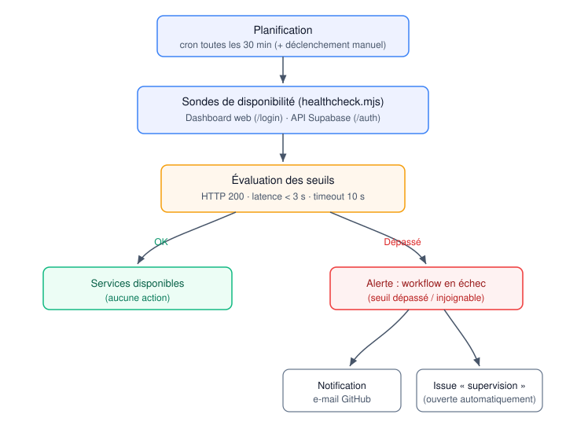

# Système de supervision et d'alerte — ResidenceConnect

> Bloc 4 — *Description du système de supervision* (compétence **C4.1.2** :
> concevoir un système de supervision et d'alerte, déterminer le périmètre,
> identifier les indicateurs, mettre en place des sondes et configurer les
> signalements pour garantir une disponibilité permanente).

Une fois l'application en production, j'avais besoin de savoir, en continu, si elle restait accessible aux utilisateurs. J'ai donc conçu un système de supervision volontairement simple, mais **réel et automatisé**, plutôt qu'une supervision décrite « sur le papier ».

## 1. Objectif et périmètre

L'objectif est de **détecter au plus vite toute indisponibilité** des services en
production, afin de rétablir le service rapidement. Le périmètre de supervision
couvre les deux composants dont dépend l'expérience utilisateur :

| Composant supervisé | Pourquoi | Impact si indisponible |
| --- | --- | --- |
| **Dashboard web** (Vercel) | Point d'entrée du gestionnaire | Le gestionnaire ne peut plus piloter les signalements |
| **API backend** (Supabase : Auth + PostgreSQL) | Sert **toutes** les apps (web ET mobile) | Plus aucune connexion ni lecture/écriture des données |

L'application mobile n'est pas sondée directement (elle s'installe sur
l'appareil), mais elle dépend du **même backend Supabase** : sa supervision est
donc couverte par la sonde backend.

## 2. Indicateurs de suivi

Pour chaque service, la supervision suit des indicateurs simples et parlants :

- **Disponibilité** : le service répond-il avec un code HTTP attendu (`200`) ?
- **Joignabilité** : le service est-il atteignable (pas de timeout / d'erreur
  réseau) ?
- **Temps de réponse (latence)** : le service répond-il assez vite ?

## 3. Sondes mises en place

La supervision est **automatisée et versionnée dans le dépôt** :

- **`scripts/healthcheck.mjs`** — exécute les sondes : une requête HTTP vers le
  dashboard web (`/login`) et une vers l'API Supabase (`/auth/v1/settings`),
  mesure le code de réponse et la latence, et sort en erreur si un seuil est
  dépassé.
- **`.github/workflows/monitoring.yml`** — planifie l'exécution des sondes
  **toutes les 30 minutes** (`cron: */30 * * * *`) et permet un déclenchement
  manuel (`workflow_dispatch`). GitHub Actions est gratuit et illimité sur un
  dépôt public.



Extrait de la définition des sondes (`scripts/healthcheck.mjs`) — chaque sonde a
son URL, son critère de disponibilité et la mesure de latence :

```js
const probes = [
  { name: 'Dashboard web (Vercel)', url: `${WEB_URL}/login`, okStatus: (s) => s === 200 },
  { name: 'API backend (Supabase Auth)', url: `${SUPABASE_URL}/auth/v1/settings`,
    headers: { apikey: SUPABASE_ANON_KEY }, okStatus: (s) => s === 200 },
];
```

Extrait de la planification (`.github/workflows/monitoring.yml`) :

```yaml
on:
  schedule:
    - cron: '*/30 * * * *' # toutes les 30 minutes
  workflow_dispatch: {}
```

## 4. Seuils d'alerte

Une sonde passe en **ALERTE** dès qu'un de ces seuils est franchi :

| Indicateur | Seuil |
| --- | --- |
| Disponibilité | code HTTP différent de `200` |
| Joignabilité | pas de réponse sous **10 s** (timeout) |
| Latence | temps de réponse **supérieur à 3 000 ms** |

Ces seuils sont paramétrables par variables d'environnement (`LATENCY_MS`, etc.).

## 5. Modalité de signalement

Quand au moins une sonde est en alerte, le script sort en **code non nul**, ce
qui **fait échouer le workflow**. Le signalement est alors double :

1. **Notification GitHub** — l'auteur du dépôt reçoit un e-mail automatique
   d'échec du workflow.
2. **Issue de signalement** — une étape `if: failure()` ouvre automatiquement une
   **issue** libellée `supervision`, contenant le lien vers les logs des sondes
   et l'action attendue.

Le signalement est ainsi **tracé** (issue) en plus d'être **poussé** (e-mail).
J'ai aussi prévu une **déduplication** : si une alerte est déjà ouverte, le
workflow n'en crée pas de nouvelle, pour éviter de multiplier les issues tant que
l'incident n'est pas résolu. Extrait du workflow :

```yaml
- name: Signalement (issue) en cas d'indisponibilité
  if: failure()
  run: |
    open=$(gh issue list --label supervision --state open --json number --jq 'length')
    if [ "$open" -gt 0 ]; then echo "Alerte déjà ouverte, pas de doublon."; exit 0; fi
    gh issue create --title "Supervision : indisponibilité détectée..." \
      --label supervision --body "Sonde en alerte. Logs : $RUN_URL"
```

### Matrice de supervision

| Indicateur | Sonde | Seuil | Signalement si dépassé |
| --- | --- | --- | --- |
| Disponibilité web | `GET /login` (Vercel) | HTTP 200 | e-mail + issue |
| Disponibilité backend | `GET /auth/v1/settings` (Supabase) | HTTP 200 | e-mail + issue |
| Joignabilité | toute sonde | réponse < 10 s | e-mail + issue |
| Latence | toute sonde | temps de réponse < 3 s | e-mail + issue |

## 6. Exécution et vérification

**Exécution nominale** (services disponibles) — sortie d'un run réel du workflow :

```
Supervision ResidenceConnect — 2026-08-20T03:23:31Z
[OK] Dashboard web (Vercel) — HTTP 200 en 116 ms
[OK] API backend (Supabase Auth) — HTTP 200 en 703 ms
Tous les services sont disponibles.
```

**Détection réelle** — la sonde a effectivement remonté une indisponibilité du
backend lorsque le projet Supabase (offre gratuite) s'était **mis en pause**
après inactivité :

```
[OK]     Dashboard web (Vercel) — HTTP 200 en 656 ms
[ALERTE] API backend (Supabase Auth) — INJOIGNABLE (fetch failed)
1 sonde(s) en alerte — signalement déclenché.
```

Le service a ensuite été relancé, et les sondes suivantes sont repassées au vert
— illustrant le cycle complet **détection → signalement → rétablissement**.

**Vérification de la chaîne d'alerte** — le signalement a aussi été validé en
exécutant la sonde contre une URL volontairement injoignable (HTTP 404 →
`ALERTE`, sortie en erreur). En exécution planifiée, ce cas fait **échouer le
workflow** → notification GitHub à l'auteur **et** ouverture automatique d'une
issue `supervision`.

## 7. Outils complémentaires

- **Tableau de bord Supabase** : métriques intégrées (nombre de requêtes, taux
  d'erreur, connexions à la base) et **logs** consultables (Auth, API, Postgres),
  utiles pour l'analyse après une alerte.
- **GitHub Actions (CI)** : le workflow `ci.yml` supervise en continu la **santé
  du code** (lint, typage, tests) à chaque modification — une forme de
  supervision préventive complémentaire à la supervision d'exécution.

## 8. Évolutions possibles

- **Suivi d'erreurs applicatives** (Sentry) pour capturer les exceptions
  runtime côté client, au-delà de la simple disponibilité.
- **Historisation des mesures** (uptime, latence) pour suivre des tendances.
