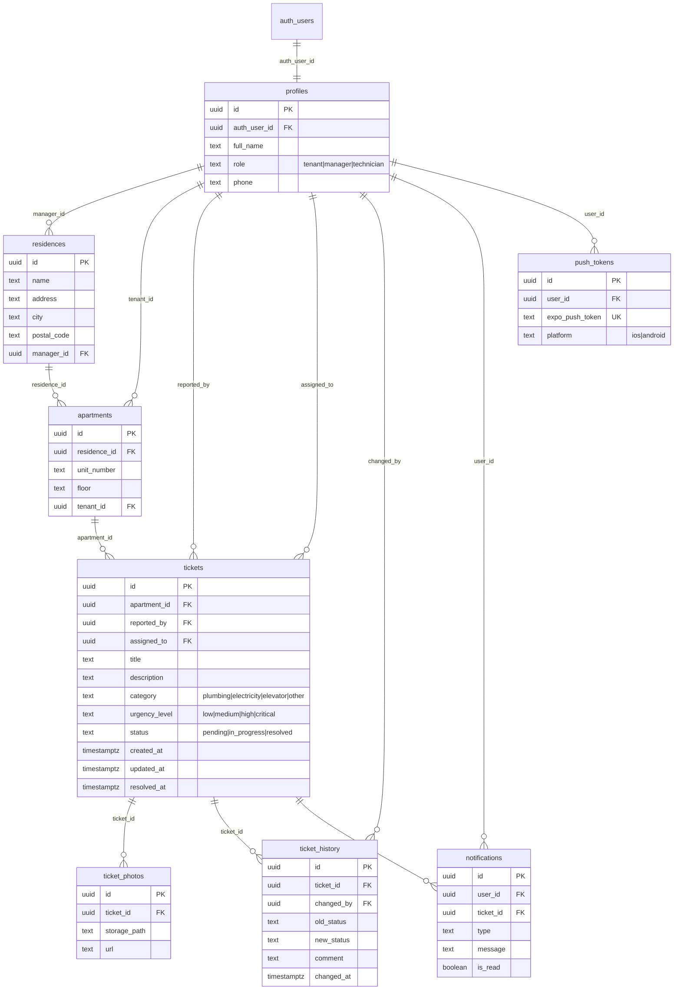

# Schéma de base de données & sécurité RLS

Base **PostgreSQL** gérée par Supabase. Source de vérité : les migrations
`supabase/migrations/`. Ce document en donne une lecture d'ensemble.

## Modèle entité-association

## Tables

| Table | Rôle | Points clés |
|-------|------|-------------|
| `profiles` | Étend `auth.users` avec les infos métier | `role` contraint ; `UNIQUE(auth_user_id)` |
| `residences` | Immeubles gérés | `manager_id` → `profiles` (RESTRICT) |
| `apartments` | Logements | `tenant_id` nullable (SET NULL) |
| `tickets` | Signalements (cœur du système) | `category`, `urgency_level`, `status` contraints ; index sur statut/urgence/dates |
| `ticket_photos` | Photos jointes (Storage) | cascade à la suppression du ticket |
| `ticket_history` | Journal d'audit des changements de statut | écriture seule |
| `notifications` | Alertes utilisateur | `is_read` par défaut `false` |
| `push_tokens` | Tokens Expo Push | `UNIQUE(expo_push_token)` |

### Index principaux

Sur `tickets` : `apartment_id`, `reported_by`, `assigned_to`, `status`,
`urgency_level`, `created_at DESC`. Sur `apartments`, `ticket_photos`,
`ticket_history`, `notifications` (dont `(user_id, is_read)`) et `push_tokens` :
index sur les clés étrangères fréquemment filtrées.

### Trigger `updated_at`

Un trigger `BEFORE UPDATE` sur `tickets` met `updated_at = NOW()` à chaque
modification.

## Fonctions & trigger d'inscription

Définis en `002_functions.sql`, en `SECURITY DEFINER` avec `search_path = ''` :

| Objet | Rôle |
|-------|------|
| `current_profile_id()` | Renvoie le `profiles.id` de l'utilisateur connecté (`auth.uid()`). |
| `current_user_role()` | Renvoie le rôle de l'utilisateur connecté. |
| `handle_new_user()` + trigger `on_auth_user_created` | Crée automatiquement le profil à l'inscription à partir des métadonnées (`full_name`, `role`, `phone`). |

> `SECURITY DEFINER` fait s'exécuter ces fonctions avec les droits du
> propriétaire et **contourne le RLS** : sans cela, une politique sur
> `profiles` qui interroge `profiles` provoquerait une récursion infinie
> (corrigée en `004_fix_rls_recursion.sql`).

## Politiques RLS (résumé)

RLS activé sur **les 8 tables**. Astuce de performance : les appels de fonction
sont enveloppés dans `(SELECT ...)` pour être évalués une seule fois par requête.

| Table | SELECT | INSERT | UPDATE | DELETE |
|-------|--------|--------|--------|--------|
| `profiles` | Son profil ; manager/technicien voient tous | *(trigger)* | Son profil | — |
| `residences` | Son manager ; locataires résidents ; technicien assigné | Manager propriétaire | Manager propriétaire | Manager propriétaire |
| `apartments` | Son locataire ; manager de la résidence ; technicien assigné | Manager de la résidence | Manager de la résidence | Manager de la résidence |
| `tickets` | Créateur ; technicien assigné ; manager de la résidence | Locataire (son logement) ou manager | Technicien assigné ou manager | Manager de la résidence |
| `ticket_photos` | Photos des tickets visibles | Créateur du ticket | Créateur du ticket | — |
| `ticket_history` | Historique des tickets visibles | Auteur du changement | — *(audit immuable)* | — *(audit immuable)* |
| `notifications` | Ses notifications | *(Edge Function, service_role)* | Marquer comme lues | — |
| `push_tokens` | Ses tokens | Ses tokens | Ses tokens | Ses tokens |

### Cloisonnement locataire — invariant de sécurité

Un locataire A **ne peut pas** lire les tickets d'un locataire B : la politique
`tickets_select` n'autorise que les lignes dont `reported_by`, `assigned_to`,
ou le manager de la résidence correspond à l'appelant. Ce cloisonnement est
appliqué par PostgreSQL, indépendamment du code client — c'est un test de
sécurité clé à rejouer sur toute évolution des politiques.
