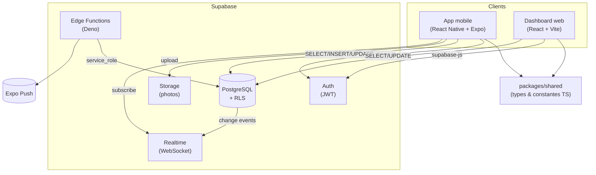
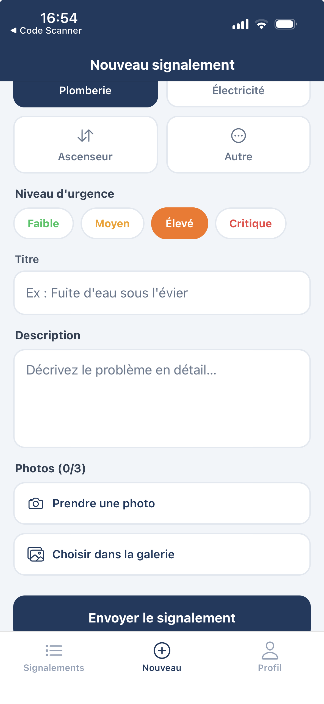
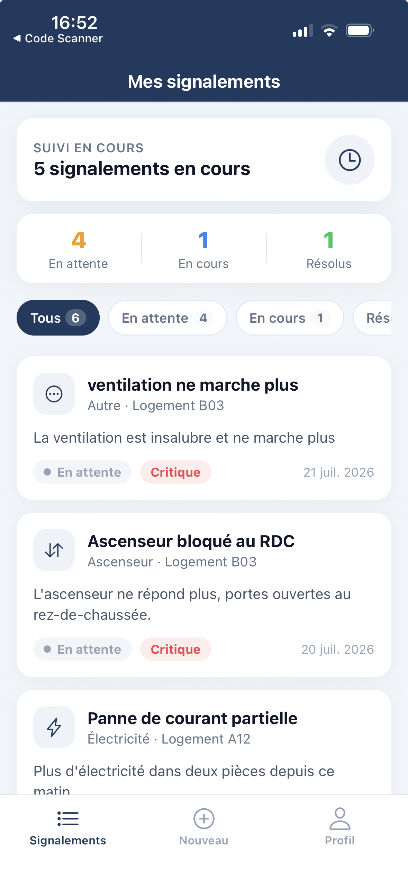
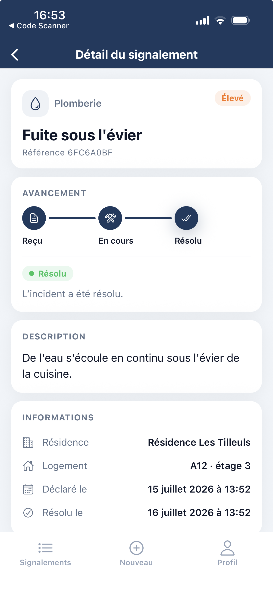
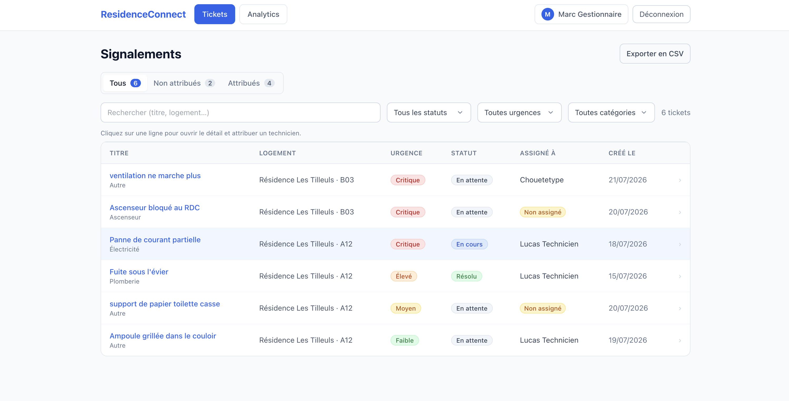
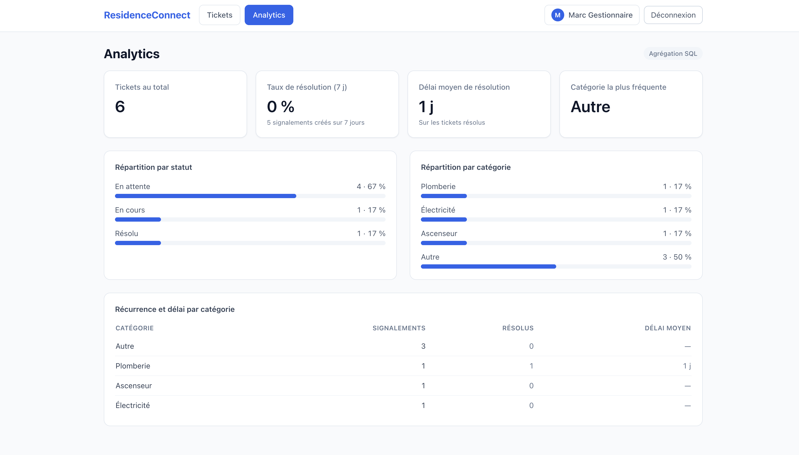
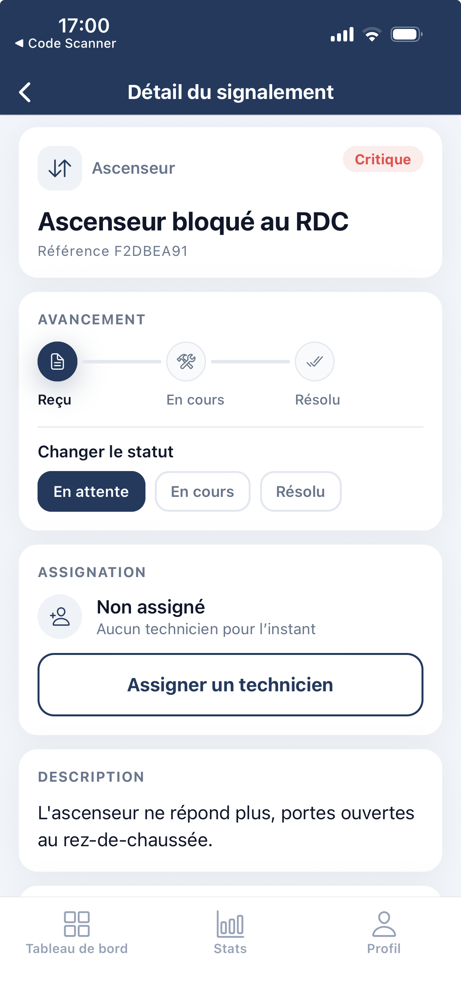
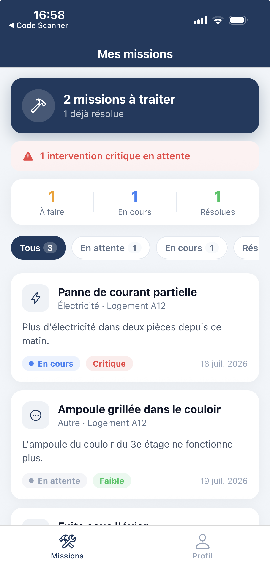
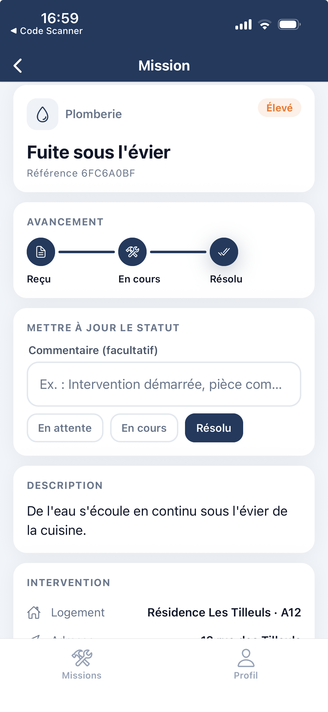

# Page de garde

**ResidenceConnect** — Application de gestion d'incidents en résidence
(bailleur social).

- **Titre visé** : Expert en développement logiciel — **RNCP 39583** (niveau 7).
- **École** : Ynov Lyon.
- **Candidat** : Gilchrist Steven LALEYE.
- **Code source (dépôt GitHub)** : <https://github.com/Dark4warrior/ResidenceConnect>
  (branche `main`, version **v1.0.0**).
- **Application web déployée** : <https://residence-connect-web.vercel.app>.
- **Comptes de démonstration** — gestionnaire : `manager@residenceconnect.dev` ·
  locataire : `tenant@residenceconnect.dev` · technicien :
  `technicien@residenceconnect.dev` — mot de passe `Demo1234!`.
- **Date** : 21/07/2026.

> Ce dossier est une **synthèse**. Chaque section renvoie à la **documentation
> associée** versionnée dans le dépôt (`docs/*.md`, `supabase/`, `.github/`),
> que le jury peut consulter directement.

---

# Sommaire

1. Le protocole de déploiement continu
2. Les critères de qualité et de performance
3. Le protocole d'intégration continue
4. Une architecture logicielle structurée (maintenabilité)
5. La présentation d'un prototype
6. L'utilisation de frameworks et paradigmes
7. Un jeu de tests unitaires couvrant une fonctionnalité
8. Les mesures de sécurité
9. Les actions pour l'accessibilité
10. L'historique des versions
11. La dernière version fonctionnelle, fiable et viable
12. Le cahier de recettes
13. Le plan de correction des bogues
14. Le manuel de déploiement
15. Le manuel d'utilisation
16. Le manuel de mise à jour

*Annexe A — Captures d'écran des trois espaces.*

---

# Correspondance des compétences

| Compétence | Intitulé (résumé) | Section | Preuve dans le dépôt |
| --- | --- | --- | --- |
| **C2.2.1** ⚠️ | Concevoir un prototype (ergonomie, équipements, sécurité) | 5 | `docs/prototype.md`, `apps/mobile/app/(tenant)/new-ticket.tsx` |
| **C2.2.2** ⚠️ | Harnais de tests unitaires (anti-régression) | 7 | `docs/tests-unitaires.md`, `apps/*/**/__tests__` |
| **C2.2.3** ⚠️ | Développer avec accessibilité, sécurisation, évolutivité | 8, 9 | `docs/accessibilite.md`, `docs/securite.md` |
| **C2.3.1** ⚠️ | Élaborer le cahier de recette | 12 | `docs/cahier-de-recettes.md` |

*(⚠️ = compétence éliminatoire)*

---

# Présentation du projet

ResidenceConnect digitalise la **gestion des incidents** dans les résidences
d'un bailleur social. Le **locataire** signale un incident depuis son mobile
(avec photo) ; le **gestionnaire** l'attribue et le suit depuis un tableau de
bord web ; le **technicien** met à jour l'intervention sur le terrain.

**Stack** : monorepo pnpm + Turborepo — `apps/mobile` (React Native 0.81 /
Expo SDK 54), `apps/web` (React 19 + Vite 5 + Tailwind), `packages/shared`
(types/constantes TypeScript), `supabase/` (PostgreSQL, Auth, Storage, Realtime,
Edge Functions Deno). Détail : **`docs/architecture.md`**.

---

# 1. Protocole de déploiement continu

Le déploiement est **automatisé par GitHub Actions** au *push* sur `main` :
`deploy-web.yml` construit et déploie le dashboard sur **Vercel**,
`build-mobile.yml` lance un **build EAS** de l'app mobile. Les deux sont
**gardés par la présence de secrets** : sans compte connecté, le build est
validé mais le déploiement est ignoré proprement, pour que `main` reste vert.

→ Détail : **`docs/ci-cd.md`** · Workflows : `.github/workflows/`.

# 2. Critères de qualité et de performance

**Qualité** outillée et imposée par la CI : TypeScript strict (zéro `any`),
ESLint, **couverture ≥ 70 %** (mobile ~97 %, web ~92 %, shared 100 %).
**Performance** traitée à la source : **13 index SQL**, **agrégation analytics
par RPC PostgreSQL**, temps réel (pas de *polling*), compression des photos,
mémoïsation des calculs de liste.

→ Détail : **`docs/qualite-performance.md`**.

# 3. Protocole d'intégration continue

`ci.yml` s'exécute à **chaque pull request** : installation reproductible,
**lint + type-check + tests + couverture**, résumé publié dans le job. Une PR
non conforme **ne peut pas être fusionnée** (filet anti-régression).

→ Détail : **`docs/ci-cd.md`**.

# 4. Architecture logicielle (maintenabilité)

**Monorepo** avec code partagé isolé dans `packages/shared` (une source de
vérité), design system mobile en tokens, séparation UI / logique (hooks) /
accès données. Architecture documentée en modèle C4 (Mermaid).

*Figure — Vue « conteneurs » (C4) : deux clients, un paquet partagé, un backend
Supabase.*

→ Détail : **`docs/architecture.md`**.

# 5. Présentation d'un prototype (C2.2.1)

Prototype présenté : le **parcours « signaler un incident »** (locataire,
mobile). Conçu **mobile-first** (usage terrain, une main), saisie **guidée** par
cartes tactiles (cibles ≥ 44 pt), ajout de photos, retours immédiats. **Sécurité
intégrée dès le prototype** : création au nom de l'utilisateur authentifié,
cloisonnement RLS, photos en bucket privé. Équipements ciblés justifiés :
**mobile** pour locataire/technicien (terrain), **web** pour le gestionnaire
(poste de travail).

*Figure — Prototype « signaler un incident » : saisie guidée par cartes
(catégorie, urgence), photos et cibles tactiles confortables.*

→ Détail : **`docs/prototype.md`** · Maquette : `design-mockups/index.html`.

# 6. Frameworks et paradigmes

React Native/Expo, React/Vite, Edge Functions Deno, monorepo pnpm/Turborepo.
Paradigmes : **UI déclarative** (React), **sécurité déclarative** (politiques
RLS PostgreSQL), **composants + hooks**, **typage statique strict** partagé
entre plateformes.

→ Détail : **`docs/frameworks-paradigmes.md`**.

# 7. Jeu de tests unitaires (C2.2.2)

Fonctionnalité couverte : le **filtrage et le tri des signalements**
(`filters.ts`), testés par **`filters.test.ts`** (10 cas : chaque filtre, ET
logique, recherche insensible à la casse, cas limites, immuabilité, tri urgence
puis date). Inscrit dans un harnais de **~180 tests** exécutés par la CI.

→ Détail : **`docs/tests-unitaires.md`**.

# 8. Mesures de sécurité

Authentification **JWT** (Supabase Auth, secure-store mobile) ; **RLS sur 8/8
tables** (cloisonnement par rôle **en base**) ; fonctions **`SECURITY DEFINER`** ;
**bucket Storage privé** + URL signées ; **journal d'audit immuable** ; secrets
en `.env` non versionnés + secrets CI ; vérification par **`scripts/test-rls.sh`**
(15 assertions). Ces mesures **couvrent l'OWASP Top 10** (tableau de
correspondance détaillé dans la doc).

→ Détail : **`docs/securite.md`**.

# 9. Actions pour l'accessibilité (C2.2.3)

Cible **WCAG 2.1 AA / RGAA**. Web : navigation clavier (tableau opérable,
skip-link, focus visible global, focus replacé après navigation), tables
sémantiques, contrastes AA, composant `Select` au motif **ARIA listbox**.
Mobile : libellés lecteurs d'écran (VoiceOver/TalkBack), états sélectionnés et
changements de statut **annoncés**, cibles ≥ 44 pt, icônes décoratives masquées.
Livré en 4 lots tracés (PR #46, #48, #51, #53).

→ Détail : **`docs/accessibilite.md`**.

# 10. Historique des versions

Versionnement **SemVer**, changements tenus dans **`CHANGELOG.md`** (Keep a
Changelog), jalons de développement et procédure de release documentés.
Traçabilité à trois niveaux : commits conventionnels, pull requests, tags.

→ Détail : **`docs/historique-versions.md`**, `CHANGELOG.md`.

# 11. Dernière version fonctionnelle, fiable et viable

**v1.0.0** sur `main` : trois parcours métier opérationnels de bout en bout,
**~180 tests verts**, CI bloquante, cahier de recettes exécuté (0 anomalie),
sécurité vérifiée. Le dashboard web est **déployé et manipulable en autonomie**
par le jury (URL Vercel + comptes de démonstration en page de garde) ; il est
aussi clonable et lançable en suivant le manuel de déploiement. Aperçu des trois
espaces en **Annexe A**.

→ Détail : **`docs/derniere-version.md`**.

# 12. Cahier de recettes (C2.3.1)

**32 scénarios** (`CR-<DOMAINE>-NN`) avec préconditions, étapes et **résultats
attendus**, couvrant auth/sécurité, les 3 espaces, le transversal et la RLS.
Campagne **exécutée** : parcours gestionnaire 10/10 conformes, **0 anomalie**.

→ Détail : **`docs/cahier-de-recettes.md`**.

# 13. Plan de correction des bogues

Process tracé : détection (CI, recette, retours) → issue → qualification
(sévérité bloquante/majeure/mineure) → branche `fix/*` → **correctif +
test de non-régression** → PR (CI verte) → release. Exemple concret : correction
de la récursion RLS (migration `004`).

→ Détail : **`docs/plan-correction-bogues.md`**.

# 14. Manuel de déploiement

Prérequis (Node 20, pnpm, Supabase), configuration `.env`, application des
migrations, déploiement Vercel/EAS, déploiement des Edge Functions,
vérifications post-déploiement.

→ Détail : **`docs/manuel-deploiement.md`**.

# 15. Manuel d'utilisation

Mode d'emploi par rôle : locataire (signaler, suivre), gestionnaire (liste,
filtres, détail, assignation, statut, analytics, export, profil), technicien
(missions, mise à jour de statut).

→ Détail : **`docs/manuel-utilisation.md`**.

# 16. Manuel de mise à jour

Flux de branches, application des nouvelles migrations, procédure de release
`develop → main` + tag, mise à jour mobile, redéploiement des Edge Functions,
et procédure de **rollback**.

→ Détail : **`docs/manuel-mise-a-jour.md`**.

---

# Annexe A — Captures d'écran

## Espace locataire (mobile)

 

*Suivi de ses signalements et détail avec frise d'avancement.*

## Espace gestionnaire (web)

*Tableau de bord : liste filtrable des signalements.*

*Analytics : indicateurs clés et répartitions.*

*Détail d'un signalement : statut, assignation et historique.*

## Espace technicien (mobile)

 

*Missions assignées et mise à jour du statut sur le terrain.*

---

# Conclusion

ResidenceConnect est un logiciel **fonctionnel, fiable et viable** (v1.0.0),
développé selon des pratiques d'ingénierie éprouvées : architecture maintenable,
sécurité appliquée en base, accessibilité conforme, harnais de tests et CI/CD.
L'ensemble des livrables est **vérifiable dans le dépôt**, et les quatre
compétences éliminatoires (C2.2.1, C2.2.2, C2.2.3, C2.3.1) sont couvertes par du
code et de la documentation dédiés.
