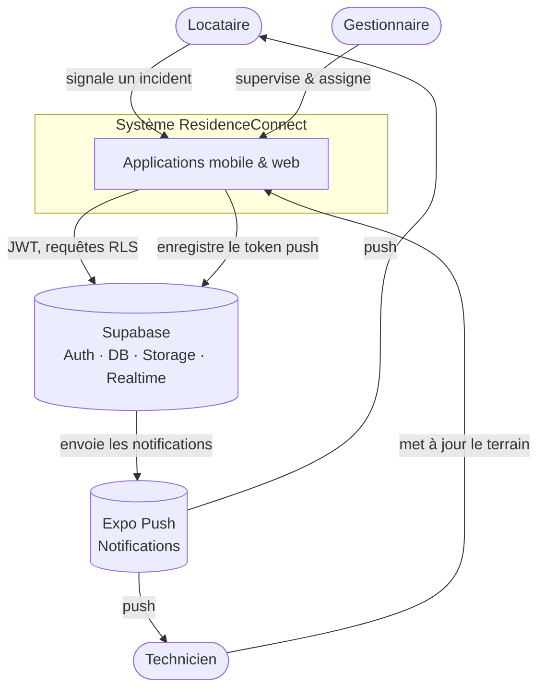
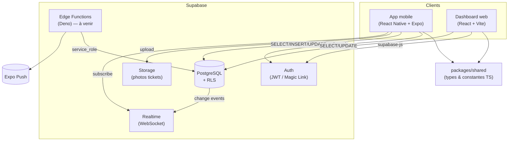

# ResidenceConnect — Dossier de projet

**Expert en développement logiciel — RNCP 39583 (niveau 7) · Ynov Lyon**

---

# Page de garde

**ResidenceConnect** — Application de gestion d'incidents en résidence (bailleur social).

- **Titre visé** : Expert en développement logiciel — **RNCP 39583** (niveau 7).
- **École** : Ynov Lyon.
- **Candidat** : Gilchrist Steven LALEYE.
- **Code source (dépôt GitHub)** : <https://github.com/Dark4warrior/ResidenceConnect> (branche `main`, version **v1.0.0**).
- **Application web déployée** : <https://residence-connect-web.vercel.app>.
- **Comptes de démonstration** — gestionnaire : `manager@residenceconnect.dev` · locataire : `tenant@residenceconnect.dev` · technicien : `technicien@residenceconnect.dev` — mot de passe `Demo1234!`.
- **Date** : 21/07/2026.

---

# Sommaire

1. Le protocole de déploiement continu
2. Les critères de qualité et de performance
3. Le protocole d'intégration continue
4. Une architecture logicielle structurée (maintenabilité)
5. La présentation d'un prototype
6. L'utilisation de frameworks et paradigmes
7. Un jeu de tests unitaires couvrant une fonctionnalité
8. Les mesures de sécurité
9. Les actions pour l'accessibilité
10. L'historique des versions
11. La dernière version fonctionnelle, fiable et viable
12. Le cahier de recettes
13. Le plan de correction des bogues
14. Le manuel de déploiement
15. Le manuel d'utilisation
16. Le manuel de mise à jour

*Annexe A — Captures d'écran des trois espaces.*

---

# Correspondance des compétences

| Compétence | Intitulé (résumé) | Section |
| --- | --- | --- |
| **C2.2.1** ⚠️ | Concevoir un prototype (ergonomie, équipements, sécurité) | 5 |
| **C2.2.2** ⚠️ | Harnais de tests unitaires (anti-régression) | 7 |
| **C2.2.3** ⚠️ | Développer avec accessibilité, sécurisation, évolutivité | 8, 9 |
| **C2.3.1** ⚠️ | Élaborer le cahier de recette | 12 |

*(⚠️ = compétence éliminatoire)*

---

# Présentation du projet

ResidenceConnect digitalise la **gestion des incidents** dans les résidences d'un bailleur social. Le **locataire** signale un incident depuis son mobile (avec photo) ; le **gestionnaire** l'attribue et le suit depuis un tableau de bord web ; le **technicien** met à jour l'intervention sur le terrain.

**Stack** : monorepo pnpm + Turborepo — `apps/mobile` (React Native 0.81 / Expo SDK 54), `apps/web` (React 19 + Vite 5 + Tailwind), `packages/shared` (types/constantes TypeScript), `supabase/` (PostgreSQL, Auth, Storage, Realtime, Edge Functions Deno).

---

# 1 & 3. Protocoles de déploiement et d'intégration continus

L'automatisation repose sur **GitHub Actions** (3 workflows dans
`.github/workflows/`) et sur le modèle de branches Git décrit ci-dessous.

## 1. Modèle de branches

- `main` — **branche de production**, toujours livrable ; c'est elle qui déclenche
  les déploiements.
- `develop` — branche d'**intégration** ; toutes les fonctionnalités y sont
  fusionnées via *pull request*.
- `feature/*`, `fix/*`, `docs/*` — une branche par sujet, une *pull request* par
  sujet, un correctif/une fonctionnalité isolés.

Chemin d'une modification : `feature/*` → PR → `develop` → PR de release →
`main` → déploiement.

## 2. Protocole d'intégration continue (`ci.yml`)

**Déclenchement** : à chaque *pull request* et à chaque *push* sur `main`.

**Étapes** (job unique `quality`, sur `ubuntu-latest`) :

1. `checkout` du code ;
2. installation de **pnpm** (version lue depuis `packageManager` du
   `package.json`) et de **Node 20** (avec cache pnpm) ;
3. `pnpm install --frozen-lockfile` (installation reproductible) ;
4. **Lint** — `pnpm lint` (ESLint) ;
5. **Typage** — `pnpm type-check` (TypeScript strict) ;
6. **Tests + couverture** — `pnpm test` (Vitest web, Jest mobile/shared), seuil
   de couverture **≥ 70 %** ;
7. **Résumé de couverture** publié dans le récapitulatif du job
   (`$GITHUB_STEP_SUMMARY`) ;
8. **archivage** des rapports de couverture en artefacts.

**Garanties** :

- une PR dont le lint, le typage ou les tests échouent **ne peut pas être
  fusionnée** (la CI passe au rouge) — c'est le filet anti-régression ;
- `concurrency` annule les exécutions obsolètes quand un nouveau commit arrive
  sur la même référence (économie de temps machine).

## 3. Protocole de déploiement continu

Le déploiement est déclenché **uniquement par un push sur `main`** — donc après
qu'une PR de release `develop → main` a été fusionnée.

### 3.1 Dashboard web — `deploy-web.yml` (Vercel)

**Déclenchement** : push sur `main`.

1. installation (pnpm + Node 20) ;
2. **build** du dashboard (`pnpm --filter @residenceconnect/web build`) avec les
   variables `VITE_SUPABASE_URL` / `VITE_SUPABASE_ANON_KEY` — le build **valide
   toujours** que l'application compile ;
3. **garde-fou** : le déploiement Vercel ne s'exécute que si le secret
   `VERCEL_TOKEN` est présent. Sinon l'étape est **ignorée proprement** (`notice`)
   au lieu de faire échouer `main`.

### 3.2 Application mobile — `build-mobile.yml` (Expo EAS)

**Déclenchement** : push sur `main` (+ déclenchement manuel `workflow_dispatch`).

1. **garde-fou** : le build EAS ne s'exécute que si le secret `EXPO_TOKEN` est
   présent ; sinon le job s'auto-ignore avec un message d'aide ;
2. installation + configuration d'EAS ;
3. **build Android** (profil `preview`, APK) sur les serveurs EAS
   (`--no-wait`).

### 3.3 Choix de conception — déploiements « gardés »

Les deux workflows de déploiement sont **conditionnés à la présence de secrets**.
Objectif : la chaîne CI/CD est **complète et fonctionnelle**, mais tant que les
comptes Vercel / EAS ne sont pas connectés, `main` **reste vert** (le build est
validé, seul le déploiement effectif est différé). Cela évite qu'une intégration
échoue pour une raison d'infrastructure et non de code.

## 4. Migrations de base de données

Le schéma Supabase est versionné sous forme de **migrations SQL numérotées**
(`supabase/migrations/001…007`), rejouables et ordonnées. Le protocole de
mise à jour de la base est détaillé dans le manuel de mise à jour
(`docs/manuel-mise-a-jour.md`).

## 5. Synthèse

| Workflow | Déclencheur | Rôle |
| --- | --- | --- |
| `ci.yml` | PR + push `main` | Qualité : lint, typage, tests, couverture (bloquant). |
| `deploy-web.yml` | push `main` | Build + déploiement Vercel (gardé par secret). |
| `build-mobile.yml` | push `main` + manuel | Build EAS Android (gardé par secret). |

---

# 2. Critères de qualité et de performance

## 1. Critères de qualité du code

| Critère | Exigence | Moyen de contrôle |
| --- | --- | --- |
| **Typage** | TypeScript **strict**, zéro `any` | `pnpm type-check` (CI bloquante) |
| **Style / erreurs** | Aucune erreur ESLint | `pnpm lint` (CI bloquante) |
| **Couverture de tests** | **≥ 70 %** | seuil imposé dans la config de test (CI) |
| **Documentation** | JSDoc sur les fonctions complexes ; docs `/docs` | revue de code |
| **Traçabilité** | 1 issue + 1 branche + 1 PR par sujet, commits conventionnels | historique Git / PR |

**Couverture mesurée** (au-delà du seuil de 70 %) : mobile ~97 %, web ~92 %,
`shared` 100 %. Les rapports sont publiés dans le récapitulatif de chaque job CI
et archivés en artefacts.

### Maintenabilité

- **Monorepo** pnpm + Turborepo : code partagé isolé dans
  `packages/shared` (types et constantes), réutilisé par le web et le mobile —
  une seule source de vérité.
- **Design system mobile** centralisé (`apps/mobile/theme`) : couleurs,
  espacements, typographie en tokens (un changement se propage partout).
- Architecture en couches documentée (`docs/architecture.md`).

## 2. Critères de performance

### 2.1 Base de données

- **Index** ciblés sur les colonnes de filtrage/jointure les plus sollicitées
  (13 index créés dès `supabase/migrations/001_initial_schema.sql`) : les
  requêtes du dashboard (par statut, urgence, logement, assignation) restent
  rapides même à volume croissant.
- **Agrégations côté serveur** : les indicateurs analytics sont calculés par une
  **fonction PostgreSQL (RPC)** (`006_analytics_rpc.sql`) plutôt que de
  rapatrier toutes les lignes au client — moins de données transférées, calcul
  au plus près de la donnée. Un repli « calcul client » existe si la RPC n'est
  pas déployée (dégradation maîtrisée, la source est affichée à l'utilisateur).

### 2.2 Réseau et médias

- **Photos compressées** avant envoi (qualité réduite à l'upload) et servies via
  **URL signées** ; bucket privé avec limite de taille.
- **Temps réel** (Supabase Realtime) : les mises à jour sont poussées aux clients
  concernés plutôt que par interrogation périodique (*polling*).

### 2.3 Traitements applicatifs

- Score d'urgence calculé par une **Edge Function** dédiée (`priority-scoring`),
  déployée et testée sur 16 combinaisons — logique déportée du client.
- Côté React, mémoïsation des calculs coûteux (filtres/tri de la liste) via
  `useMemo` pour éviter les recalculs inutiles au rendu.

## 3. Moyens de contrôle continu

- **CI GitHub Actions** (`ci.yml`) : lint + type-check + tests + couverture à
  chaque *pull request* — une PR non conforme ne peut pas être fusionnée
  (cf. `docs/ci-cd.md`).
- **~180 tests unitaires** couvrant la logique métier (filtres, tri, scoring,
  CSV, analytics, hooks, navigation clavier du `Select`).
- **Tests de sécurité** (`scripts/test-rls.sh`) et **cahier de recettes**
  fonctionnel.

## 4. Synthèse

La qualité est **outillée et non déclarative** : typage strict, lint et seuil de
couverture sont **imposés par la CI**. La performance est traitée à la source
(index, agrégation SQL, temps réel, compression) plutôt que corrigée après coup.

---

# 4. Architecture logicielle (maintenabilité)

Ce document décrit l'architecture selon le modèle **C4** (Context, Container,
Component) et justifie les principaux choix techniques.

## 1. Contexte (niveau 1)

Qui utilise le système et avec quels services externes il interagit.



## 2. Conteneurs (niveau 2)

Les unités déployables et leurs communications.



Chaque client dépend de `packages/shared` pour garantir des types identiques
de bout en bout (statuts, catégories, niveaux d'urgence, entités).

_Les schémas de composants (niveau 3, mobile et web) figurent dans `docs/architecture.md`._

## 5. Choix techniques

| Décision | Justification |
|----------|---------------|
| **Monorepo Turborepo + pnpm** | Partage de types entre mobile et web, cache de tâches, une seule source de vérité. |
| **Supabase** | Auth + PostgreSQL + Storage + Realtime + Edge managés : réduit l'infra à maintenir tout en gardant du SQL standard. |
| **RLS sur 100 % des tables** | La sécurité d'accès est appliquée **au plus près de la donnée** : même en cas de bug client, un locataire ne peut pas lire les tickets d'un autre. |
| **Fonctions `SECURITY DEFINER` + `search_path=''`** | Évitent la récursion des politiques sur `profiles` et protègent contre le détournement de schéma. |
| **Trigger `handle_new_user`** | Crée le profil automatiquement à l'inscription, sans insertion cliente ni contournement du RLS. |
| **Expo SDK 54** | Compatible avec l'app Expo Go publique (les SDK 56+ nécessitent un build custom). |
| **React 19 côté web** | Aligné sur la version du mobile dans le monorepo : évite les conflits de types `@types/react` en installation *hoisted*. |
| **TypeScript strict partout** | `strict: true`, zéro `any` : les erreurs sont détectées à la compilation. |

## 6. Sécurité — résumé

- Authentification par **JWT** géré par Supabase Auth.
- **RLS** activé sur toutes les tables ; les politiques s'appuient sur l'identité
  (`current_profile_id()`) et le rôle (`current_user_role()`) de l'appelant.
- Le **journal d'audit** (`ticket_history`) est en écriture seule : ni update ni
  delete côté client.
- Les secrets (URL, clés) sont fournis par variables d'environnement, jamais en
  dur ; seuls les fichiers `.env.example` (sans valeur) sont versionnés.

Détail du modèle de données et des politiques : voir
[database-schema.md](database-schema.md).

---

# 5. Présentation d'un prototype

## 1. Prototype retenu : le signalement d'incident par le locataire (mobile)

Le prototype présenté est le **parcours « Signaler un incident »**, cœur métier
de l'application côté locataire. Une première maquette statique a été réalisée
(`design-mockups/index.html`) puis concrétisée dans l'écran
`apps/mobile/app/(tenant)/new-ticket.tsx`.

## 2. Équipements ciblés — un choix justifié

| Rôle | Équipement | Pourquoi |
| --- | --- | --- |
| **Locataire** | **Mobile** | Signale depuis chez lui, souvent avec une **photo** prise sur le moment. |
| **Technicien** | **Mobile** | Sur le terrain, met à jour ses missions en déplacement. |
| **Gestionnaire** | **Web** | Travaille depuis un poste, a besoin d'un **tableau de bord** large (liste, filtres, analytics, export). |

Le prototype locataire est donc pensé **mobile-first** : usage à une main,
en extérieur, potentiellement en connexion instable.

## 3. Spécificités ergonomiques

- **Saisie guidée, pas de champ libre inutile** : la catégorie et le niveau
  d'urgence se choisissent par **cartes / puces** tactiles (pas de menu
  déroulant), avec un exemple de titre proposé selon la catégorie.
- **Cibles tactiles confortables** (≥ 44 pt), boutons pleine largeur.
- **Ajout de photo** en deux gestes (caméra ou galerie), avec aperçu et
  suppression, limité à 3 pour rester lisible.
- **Retours immédiats** : messages d'erreur explicites, indicateur de
  chargement, désactivation des actions pendant l'envoi.
- **Accessibilité intégrée** : libellés lecteurs d'écran, états sélectionnés
  annoncés, contrastes conformes (cf. `docs/accessibilite.md`).

## 4. Fonctionnalités couvertes par le prototype

1. Choix du logement (si l'utilisateur en a plusieurs).
2. Choix de la catégorie et de l'urgence.
3. Saisie du titre et de la description (avec limites de longueur).
4. Ajout de photos (caméra / galerie).
5. Validation des champs obligatoires.
6. Envoi → création du signalement + upload des photos → retour à la liste avec
   suivi de l'avancement.

## 5. Sécurité prise en compte dès le prototype

- Le signalement est créé **au nom de l'utilisateur authentifié**
  (`reported_by = profil courant`) ; impossible d'écrire pour autrui.
- Les données créées restent **cloisonnées par la RLS** : le locataire ne verra
  que ses propres signalements.
- Les **photos** partent dans un **bucket privé** (pas d'URL publique), avec
  limite de taille et types d'images autorisés.
- Le prototype ne fait **aucune confiance au client** pour les règles d'accès :
  celles-ci sont appliquées en base (cf. `docs/securite.md`).

## 6. Du prototype au produit

Le prototype a validé les choix d'ergonomie et de parcours avant l'implémentation
complète. Il se prolonge dans les autres écrans (suivi de l'avancement côté
locataire, dashboard côté gestionnaire) qui réutilisent les mêmes composants et
tokens de design, garantissant une expérience cohérente sur les deux plateformes.


*Figure — Prototype « signaler un incident » (espace locataire, mobile).*

---

# 6. Utilisation de frameworks et de paradigmes

## 1. Frameworks et technologies

| Couche | Technologie | Rôle |
| --- | --- | --- |
| Mobile | **React Native 0.81 / Expo SDK 54** (Expo Router) | Applications iOS/Android à partir d'une base unique. |
| Web | **React 19 + Vite 5 + Tailwind CSS + React Router** | Dashboard gestionnaire, build rapide. |
| Langage | **TypeScript strict** (partout) | Typage statique, moins d'erreurs à l'exécution. |
| Backend | **Supabase** (PostgreSQL, Auth, Storage, Realtime) | Base, authentification, fichiers, temps réel managés. |
| Fonctions | **Edge Functions Deno** | Logique serveur légère (scoring, notifications). |
| Monorepo | **pnpm + Turborepo** | Orchestration des paquets, cache de tâches. |

## 2. Paradigmes de développement

### 2.1 Programmation déclarative (UI)

React et React Native reposent sur un paradigme **déclaratif** : on décrit
l'interface **en fonction de l'état**, et le framework se charge de la mettre à
jour. Le code exprime *quoi* afficher, pas *comment* manipuler le DOM.

### 2.2 Composants et hooks

- **Composition de composants** réutilisables (`Button`, `Input`, `Select`,
  `TicketCard`…) : une brique, une responsabilité.
- **Hooks** pour la logique d'état et les effets (`useTickets`, `useAuth`,
  `useTicketHistory`…), qui isolent la logique métier de l'affichage.

### 2.3 Sécurité déclarative en base (RLS)

Le cloisonnement des données est exprimé de façon **déclarative** via les
politiques **Row Level Security** de PostgreSQL, plutôt que par du code
impératif côté client. La règle d'accès est *déclarée une fois* et s'applique à
toute requête (cf. `docs/securite.md`).

### 2.4 Typage statique

Le **typage strict** (TypeScript, zéro `any`) est un paradigme transverse : les
contrats de données (types partagés dans `packages/shared`) sont vérifiés à la
compilation, sur le web comme sur le mobile.

### 2.5 Architecture en monorepo

Le code commun (types, constantes) vit dans **`packages/shared`** et alimente les
deux applications — une seule source de vérité, pas de duplication (cf.
`docs/architecture.md`).

## 3. Conventions transverses

- Gestion d'erreur explicite sur les appels réseau / base.
- JSDoc sur les fonctions complexes.
- Commits conventionnels, une branche/PR par sujet.
- Variables sensibles en `.env` (jamais en dur).

## 4. Synthèse

Le projet combine un socle **déclaratif** (UI React, sécurité RLS), un **typage
statique strict** partagé entre plateformes, et une **organisation monorepo**
qui maximise la réutilisation — trois choix orientés **maintenabilité** et
**fiabilité**.

---

# 7. Jeu de tests unitaires

## 1. Fonctionnalité couverte : le filtrage et le tri des signalements

La fonctionnalité présentée est le **filtrage et le tri de la liste des
signalements** du dashboard gestionnaire — une exigence centrale (retrouver
rapidement un signalement parmi beaucoup). La logique est **isolée dans des
fonctions pures** (`filterTickets`, `sortByUrgencyThenDate` dans
`apps/web/src/lib/filters.ts`), donc facilement testable sans interface.

Le jeu de tests associé : **`apps/web/src/lib/__tests__/filters.test.ts`**
(10 cas).

## 2. Cas de test

| # | Cas | Vérifie |
| --- | --- | --- |
| 1 | Sans filtre | renvoie tous les tickets |
| 2 | Filtre par statut | ne garde que le statut demandé |
| 3 | Filtre par urgence | ne garde que l'urgence demandée |
| 4 | Filtre par catégorie | ne garde que la catégorie demandée |
| 5 | Combinaison de filtres | applique un **ET** logique |
| 6 | Recherche | **insensible à la casse**, sur titre et logement |
| 7 | Recherche sans résultat | renvoie une liste vide |
| 8 | Immuabilité (filtre) | ne mute pas le tableau d'entrée |
| 9 | Tri urgence puis date | ordre décroissant sur les deux critères |
| 10 | Immuabilité (tri) | ne mute pas le tableau d'entrée |

Les cas ne couvrent pas seulement le chemin nominal : ils testent aussi les
**cas limites** (aucun résultat, combinaison impossible) et une **propriété de
robustesse** (les fonctions ne modifient pas leurs entrées, ce qui évite des
bogues d'effet de bord).

## 3. Extrait

```ts
describe('filterTickets', () => {
  const tickets = [
    makeTicket({ status: 'pending', urgency_level: 'low', category: 'plumbing', title: 'Robinet' }),
    makeTicket({ status: 'resolved', urgency_level: 'critical', category: 'elevator', title: 'Ascenseur bloqué' }),
    makeTicket({ status: 'in_progress', urgency_level: 'high', category: 'electricity', title: 'Panne de courant' }),
  ];

  it('combine plusieurs filtres (ET logique)', () => {
    const res = filterTickets(
      tickets,
      withFilters({ status: 'pending', category: 'electricity' })
    );
    expect(res).toHaveLength(0);
  });

  it('recherche insensible à la casse dans titre et logement', () => {
    expect(filterTickets(tickets, withFilters({ search: 'ASCENSEUR' }))).toHaveLength(1);
  });
});
```

*Motif « Arrange–Act–Assert »* : on prépare des données représentatives
(`makeTicket`, une fabrique de test), on exécute la fonction, on vérifie le
résultat attendu.

## 4. Un harnais, pas un test isolé

Ce jeu s'inscrit dans un **harnais global de ~180 tests unitaires** :

- **Web (Vitest)** : filtres, tri, export CSV (13 cas), analytics, hooks,
  navigation clavier du composant `Select` (5 cas d'accessibilité).
- **Mobile (Jest)** : hooks (`useTickets`, `useTicketHistory`, `useApartments`,
  `useRealtime`), gestion des photos, stockage sécurisé, calculs analytiques.
- **`shared`** : constantes et utilitaires métier (couverture 100 %).

## 5. Prévention des régressions

- Les tests s'exécutent **à chaque *push* et *pull request*** via la CI
  (`ci.yml`) ; une PR qui casse un test **ne peut pas être fusionnée**.
- **Seuil de couverture ≥ 70 %** imposé (mobile ~97 %, web ~92 %, shared 100 %).
- **Règle d'équipe** : tout correctif de bogue est accompagné d'un test qui
  reproduit le bug (cf. `docs/plan-correction-bogues.md`), garantissant qu'il ne
  réapparaîtra pas.

## 6. Exécution

```bash
pnpm test                              # tout le monorepo, avec couverture
pnpm --filter @residenceconnect/web test
pnpm --filter @residenceconnect/mobile test
```

---

# 8. Mesures de sécurité

La sécurité de ResidenceConnect repose sur un principe directeur : **le
cloisonnement des données est appliqué en base**, pas côté client. Même en cas
de compromission de l'application, un utilisateur ne peut accéder qu'à ses
propres données.

## 1. Authentification (JWT)

- Authentification gérée par **Supabase Auth** : mots de passe hachés côté
  serveur (jamais stockés en clair), sessions par **jeton JWT** signé.
- Le jeton est transmis à chaque requête ; PostgreSQL en extrait l'identité
  (`auth.uid()`) et le rôle pour appliquer les règles d'accès.
- Côté mobile, le jeton de session est conservé dans le **stockage sécurisé**
  du système (`expo-secure-store`), pas dans un stockage en clair.

## 2. Cloisonnement par rôle — RLS (Row Level Security)

- **RLS activée sur 100 % des tables** (`ENABLE ROW LEVEL SECURITY` sur les
  8 tables — `supabase/migrations/003_rls_policies.sql`).
- Chaque rôle ne voit et ne modifie que ce qui le concerne :
  - **locataire** — uniquement les signalements de ses logements ;
  - **technicien** — uniquement les signalements qui lui sont assignés ;
  - **gestionnaire** — les signalements de son périmètre de gestion.
- Le contrôle est **déclaratif et centralisé en base** : il s'applique à toute
  requête, quelle que soit l'origine (app mobile, dashboard web, appel API
  direct).

### `SECURITY DEFINER`

Certaines vérifications d'accès nécessitent de lire une table elle-même
protégée, ce qui provoquerait une récursion. Elles sont isolées dans des
fonctions **`SECURITY DEFINER`** (migrations `002_functions.sql`,
`004_fix_rls_recursion.sql`, `007_status_change_webhook.sql`), qui s'exécutent
avec des droits maîtrisés et cassent la boucle — cf. le plan de correction des
bogues pour l'anomalie de récursion corrigée.

## 3. Stockage privé des photos

- Le bucket **`ticket-photos` est privé** (`public = false`,
  `supabase/migrations/005_storage_ticket_photos.sql`) : aucune photo n'est
  accessible par URL publique.
- L'accès aux fichiers passe par des **URL signées temporaires** générées à la
  demande pour les utilisateurs autorisés.
- Le bucket impose une **limite de taille** et une **liste de types MIME
  autorisés** (images uniquement).

## 4. Journal d'audit immuable

- Chaque changement de statut est enregistré dans `ticket_history` (auteur,
  ancien/nouveau statut, horodatage), via un **trigger** en base — l'écriture
  n'est pas laissée au client.
- Les entrées sont **immuables** (pas de modification ni de suppression), ce qui
  garantit une piste d'audit fiable (vérifié en recette, cf.
  `docs/cahier-de-recettes.md`, CR-TR-02).

## 5. Gestion des secrets

- Aucune donnée sensible en dur dans le code : les variables sensibles vivent
  dans des fichiers `.env` **non versionnés** (`.gitignore`) et dans les
  **secrets GitHub Actions** pour la CI/CD.
- Seule la **clé anonyme publique** Supabase est exposée côté client — c'est sa
  fonction (elle ne donne aucun accès au-delà de ce que la RLS autorise).
- Les Edge Functions et le webhook utilisent des secrets côté serveur
  (service role, jamais transmis au client).

## 6. Robustesse du code

- **TypeScript strict** (zéro `any`) : réduit les erreurs de manipulation de
  données.
- **Gestion d'erreur explicite** sur les appels réseau / base.
- Validation des entrées (champs obligatoires, tailles maximales, types de
  fichiers).

## 7. Vérification de la sécurité

- **`scripts/test-rls.sh`** : 15 assertions exécutées contre un vrai projet
  Supabase, qui vérifient le cloisonnement (un rôle ne peut pas lire/écrire les
  données d'un autre).
- Les scénarios de sécurité du cahier de recettes (CR-SEC-01→03) s'appuient sur
  ce script.

## 8. Couverture des risques OWASP Top 10 (2021)

Les mesures ci-dessus adressent les **10 principales failles de sécurité** du
référentiel **OWASP Top 10**.

| # OWASP | Risque | Mesure dans ResidenceConnect |
| --- | --- | --- |
| **A01** | Contrôle d'accès défaillant | **RLS sur 100 % des tables** (cloisonnement par rôle **en base**, appliqué à toute requête), fonctions `SECURITY DEFINER`, accès web réservé au rôle gestionnaire. |
| **A02** | Défaillances cryptographiques | HTTPS/TLS partout (Supabase, Vercel) ; mots de passe **hachés** côté serveur ; JWT signé ; jeton mobile en **secure-store** ; aucun secret en clair dans le code. |
| **A03** | Injection | Accès aux données via le client Supabase (**requêtes paramétrées**, pas de SQL concaténé depuis une entrée utilisateur) ; typage strict ; validation des entrées. |
| **A04** | Conception non sécurisée | **Moindre privilège** par défaut (RLS), stockage privé, journal d'audit immuable — la sécurité est pensée dès la conception (cf. `docs/prototype.md`). |
| **A05** | Mauvaise configuration | Bucket Storage **privé** (`public=false`), secrets en variables d'environnement, déploiements **gardés par secret**, seule la clé **anon publique** exposée. |
| **A06** | Composants vulnérables / obsolètes | Dépendances figées (`pnpm --frozen-lockfile`), stack récente maintenue, installation reproductible en CI. |
| **A07** | Défaillances d'authentification | **Supabase Auth** (JWT, gestion de session), **longueur minimale** de mot de passe à l'inscription, message de connexion **générique** (pas d'énumération de comptes). |
| **A08** | Défaut d'intégrité logiciel/données | `--frozen-lockfile`, JWT signé, **migrations versionnées** et **journal d'audit immuable**. |
| **A09** | Journalisation / supervision insuffisante | **`ticket_history`** (piste d'audit immuable des changements) + journaux Supabase. |
| **A10** | SSRF | Pas de récupération d'URL contrôlée par l'utilisateur ; les Edge Functions n'appellent que des points de terminaison **maîtrisés**. |

## 9. Synthèse

| Mesure | Mise en œuvre |
| --- | --- |
| Authentification | Supabase Auth, JWT, secure-store (mobile) |
| Autorisation | RLS sur 8/8 tables, cloisonnement par rôle en base |
| Anti-récursion | Fonctions `SECURITY DEFINER` |
| Fichiers | Bucket privé + URL signées + limites taille/MIME |
| Auditabilité | `ticket_history` immuable (trigger) |
| Secrets | `.env` non versionnés + secrets CI ; seule la clé anon publique exposée |
| Conformité | Couverture **OWASP Top 10** (§8) |
| Vérification | `scripts/test-rls.sh` (15 assertions) |

---

# 9. Actions pour l'accessibilité

## 1. Démarche et référentiels

L'accessibilité de ResidenceConnect vise le niveau **WCAG 2.1 AA** (référentiel
international) et s'aligne sur le **RGAA 4** (déclinaison française). L'objectif
est que les trois profils utilisateurs — locataire, gestionnaire, technicien —
puissent utiliser l'application **au clavier**, **au lecteur d'écran**
(VoiceOver sur iOS, TalkBack sur Android, lecteurs de bureau sur le web) et avec
une **basse vision** (contrastes, tailles de cible).

La démarche a suivi trois temps :

1. **Audit** de l'existant, fichier par fichier, sur les deux applications
   (web et mobile) — labels manquants, éléments non atteignables au clavier,
   contrastes insuffisants, cibles tactiles trop petites, absence d'annonces.
2. **Renforcement du code**, regroupé en quatre lots livrés par *pull request*
   dédiée (traçabilité, cf. §7).
3. **Vérification** : lint, typage strict, tests unitaires, et contrôle en
   conditions réelles (arbre d'accessibilité du navigateur, pilotage clavier,
   export du bundle mobile).

Le périmètre couvre **l'application web** (React 19 + Vite, tableau de bord
gestionnaire) et **l'application mobile** (React Native / Expo, les trois
espaces).

## 2. Structure sémantique et repères de navigation (web)

| Action | Détail | Fichier |
| --- | --- | --- |
| Repères ARIA (`landmarks`) | `<main>`, `<header>`, `<nav aria-label>` présents sur toutes les vues, y compris hors gabarit (Login, 404, accès refusé) | `apps/web/src/components/Layout.tsx`, `Login.tsx`, `NotFound.tsx`, `ProtectedRoute.tsx` |
| Lien d'évitement | « Aller au contenu » (skip-link), visible au focus, cible `#main` — RGAA 12.7 | `apps/web/src/components/Layout.tsx` |
| Hiérarchie de titres | un `<h1>` par page, sections en `<h2>` (auparavant de simples `<p>` stylés) | `TicketDetail.tsx`, `Analytics.tsx` |
| `lang` du document | `<html lang="fr">` | `apps/web/index.html` |

## 3. Navigation au clavier

**Web.** Tout est atteignable et actionnable sans souris :

- Les **lignes du tableau des signalements**, auparavant cliquables à la souris
  uniquement (`<tr onClick>`), exposent désormais un **vrai lien** décrivant la
  ligne (« Ouvrir le signalement : … logement … créé le … ») dans la cellule
  titre. La **sémantique de tableau est préservée** (pas de `role="button"` sur
  la ligne, qui l'aurait cassée). → `apps/web/src/pages/Dashboard.tsx`
- **Focus visible homogène** sur tous les boutons d'action via une règle
  globale `:focus-visible` (anneau bleu marque). Choix **maintenable** : une
  seule règle couvre les boutons présents et futurs, sans dupliquer un style sur
  chaque composant. → `apps/web/src/index.css`
- À chaque **changement de route** (SPA), le focus est ramené sur le contenu
  principal, pour ne pas laisser l'utilisateur clavier « bloqué » sur le dernier
  élément cliqué. → `apps/web/src/components/Layout.tsx`

**Cas d'étude — la liste déroulante des filtres.** Le composant `Select` est une
liste déroulante personnalisée (un `<select>` natif n'est pas stylable). Elle a
été réécrite selon le **motif ARIA _listbox_** :

- la liste ouverte reçoit le focus et expose l'option active via
  `aria-activedescendant` (les options ne sont pas focusables une à une) ;
- navigation **flèches haut/bas**, **Origine/Fin**, **saisie au vol**
  (typeahead) ;
- **Entrée / Espace** valide, **Échap** annule, et le **focus revient au bouton
  déclencheur** à la fermeture.

→ `apps/web/src/components/Select.tsx`, couvert par
`apps/web/src/components/__tests__/Select.test.tsx`.

## 4. Compatibilité lecteurs d'écran

**Web.**

- Toutes les images utiles portent un `alt` ; les icônes décoratives sont en
  `aria-hidden`.
- Les tableaux de données ont des en-têtes `<th scope="col">` et une
  `<caption>` (lue par le lecteur, masquée visuellement).
- Les messages d'erreur sont annoncés (`role="alert"`).
- Chaque champ de formulaire a un libellé associé (`<label>`, `htmlFor` ou
  `aria-label`).

**Mobile (React Native).** L'API d'accessibilité de React Native a été appliquée
systématiquement :

| Élément | Traitement | Fichiers |
| --- | --- | --- |
| Boutons | `accessibilityRole="button"` + `accessibilityState` (`disabled`, `busy`, `selected`) | `components/ui/Button.tsx`, écrans `ticket/[id]`, `new-ticket.tsx` |
| Champs de saisie | nom accessible relié (`accessibilityLabel`), plus de champ « anonyme » reposant sur le seul placeholder | `components/ui/Input.tsx`, `app/(auth)/login.tsx`, `register.tsx` |
| Bouton afficher/masquer mot de passe | rôle + libellé dynamique (« Afficher / Masquer le mot de passe ») | `components/ui/Input.tsx` |
| Cartes de la liste | libellé récapitulatif lu **d'un seul tenant** (titre, catégorie, logement, statut, urgence, date) | `components/tickets/TicketCard.tsx` |
| Choix (catégorie, urgence, logement, rôle, technicien) | `accessibilityState={{ selected }}` pour annoncer l'option active | `new-ticket.tsx`, `register.tsx`, `(manager)/ticket/[id].tsx` |
| Images | `accessibilityLabel` (« Photo N sur M », « Photo en plein écran ») | `TicketPhotos.tsx`, `(tenant)/ticket/[id].tsx`, `new-ticket.tsx` |
| Icônes décoratives | masquées (`accessibilityElementsHidden` / `importantForAccessibility="no"`) pour éviter le bruit | tous les écrans touchés |
| Modale d'assignation | `accessibilityViewIsModal`, titre en `accessibilityRole="header"` | `(manager)/ticket/[id].tsx` |

**Annonces dynamiques.** Les changements sans transition visuelle explicite sont
annoncés vocalement :

- changement de statut d'un signalement →
  `AccessibilityInfo.announceForAccessibility("Statut mis à jour : …")`
  (`(manager)` et `(technician)/ticket/[id].tsx`) ;
- erreurs de formulaire → `accessibilityLiveRegion` sur les encarts d'erreur.

## 5. Contrastes et présentation visuelle

- **Web** : la couleur de texte informatif `text-slate-400` (contraste ≈ 2,8:1
  sur blanc, **échec AA**) a été remplacée par `text-slate-500` (≈ 4,8:1,
  **conforme AA**) partout où il s'agit de texte réel (les éléments purement
  décoratifs `aria-hidden` restent inchangés). → `Dashboard.tsx`,
  `TicketDetail.tsx`, `Analytics.tsx`, `StatCard.tsx`, `Login.tsx`
- **Mobile** : le token de design `textLight` valait `#94A3B8` (contraste
  ≈ 2,6:1, **échec AA**). Il a été relevé à `#67768C` (≈ 4,6:1, **conforme
  AA**), tout en restant plus clair que `textMuted`. La hiérarchie visuelle
  repose désormais aussi sur la graisse et la taille, pas uniquement sur un gris
  trop pâle. → `apps/mobile/theme/index.ts`

Le design mobile s'appuie sur un **système de tokens centralisé**
(`apps/mobile/theme/index.ts`) : corriger un contraste à un seul endroit se
répercute sur toute l'application.

## 6. Cibles tactiles (mobile)

Les zones interactives visent le **minimum de 44 × 44 pt** recommandé (WCAG
2.5.5 / HIG Apple) :

- boutons principaux `Button` : hauteur 54 pt ;
- bouton œil du champ mot de passe et **suppression de photo** : `hitSlop`
  étendu à 12 pt sur chaque bord (≈ 44 pt de cible réelle autour d'une icône de
  22 pt). → `components/ui/Input.tsx`, `app/(tenant)/new-ticket.tsx`

## 7. Traçabilité (vérifiable dans le dépôt)

Chaque lot a été livré par une issue + une branche + une *pull request* dédiées,
avec des commits en français au format conventionnel :

| Lot | Portée | Issue / PR |
| --- | --- | --- |
| A | Web — navigation clavier & repères | #45 / #46 |
| B | Web — focus, tables, titres, contraste, Select clavier | #47 / #48 |
| C | Mobile — composants transverses (Button, Input, auth, tokens) | #50 / #51 |
| D | Mobile — écrans, états sélectionnés, annonces, cibles | #52 / #53 |

## 8. Vérification et tests

- **Typage strict** (TypeScript, zéro `any`) et **lint** sans erreur sur les
  deux applications.
- **Tests unitaires** : le comportement clavier du composant `Select` est
  couvert par 5 tests dédiés (ouverture clavier, navigation par flèches,
  Origine/Fin, saisie au vol, validation, fermeture par Échap) —
  `apps/web/src/components/__tests__/Select.test.tsx`. Suites vertes :
  **77/77** (web) et **77/77** (mobile).
- **Contrôle en conditions réelles** (web) : arbre d'accessibilité du navigateur
  (présence du skip-link, des repères, des libellés de ligne), pilotage complet
  du `Select` au clavier, focus replacé après navigation.
- **Mobile** : compilation validée par l'export du bundle Metro
  (`expo export`) ; le rendu et les lecteurs d'écran (VoiceOver / TalkBack) sont
  validés sur appareil réel.

## 9. Limites connues et pistes d'amélioration

- Pas de **mode sombre** ni de prise en compte de `prefers-color-scheme`.
- Contrôle des contrastes **manuel** (pas encore d'audit automatisé type
  axe-core intégré à la CI).
- Le `Select` custom implémente l'essentiel du motif _listbox_ ; un audit
  lecteur d'écran approfondi pourrait affiner les annonces d'ouverture.

Ces points sont documentés comme dette d'accessibilité assumée, à traiter dans
une itération ultérieure.

---

# 10. Historique des versions

## 1. Stratégie de versionnement

ResidenceConnect suit le **versionnement sémantique** (SemVer) :
`MAJEUR.MINEUR.CORRECTIF`.

- **MAJEUR** — changement incompatible (rupture d'API ou de modèle) ;
- **MINEUR** — nouvelle fonctionnalité rétrocompatible ;
- **CORRECTIF** — correction de bogue rétrocompatible.

Chaque version livrable est **marquée par un tag Git** (`vX.Y.Z`) sur `main` et
publiée en **release GitHub**. Le détail des changements est tenu dans
`CHANGELOG.md` (format *Keep a Changelog*).

## 2. Traçabilité

L'historique complet est **vérifiable dans le dépôt** à trois niveaux :

1. **Commits** conventionnels (`feat:`, `fix:`, `docs:`, `test:`, `chore:`,
   `ci:`, `refactor:`) en français ;
2. **Pull requests** — une par sujet, reliée à son issue (`Closes #NN`), qui
   documente le quoi et le pourquoi ;
3. **Tags & releases** — les jalons livrables.

## 3. Jalons de développement (avant 1.0.0)

Le Bloc 2 a été construit par incréments successifs, intégrés sur `develop`
puis publiés sur `main` :

| Jalon | Contenu |
| --- | --- |
| Socle | Schéma PostgreSQL + index, authentification JWT, politiques RLS. |
| Signalements | Création avec photo, suivi, temps réel, journal d'audit de bout en bout. |
| Dashboard web | Liste + filtres, détail, assignation, statut, analytics, export CSV. |
| Edge Functions | `priority-scoring` et `notify-status-change` (déployées et testées). |
| Durcissement | Correction de la récursion RLS (migration 004), bucket Storage privé, RPC analytique, webhook de changement de statut. |

Ces jalons sont matérialisés par les migrations numérotées
(`supabase/migrations/001…007`) et par les *pull requests* fusionnées.

## 4. Versions publiées

| Version | Date | Description |
| --- | --- | --- |
| **v1.0.0** | 2026-07-21 | Première version fonctionnelle, fiable et viable : les 3 espaces mobile, le dashboard web, la sécurité RLS, les Edge Functions, l'accessibilité WCAG AA, la CI/CD et la documentation. Voir `CHANGELOG.md`. |

## 5. Procédure de publication d'une version

1. S'assurer que `develop` est vert (CI) et que le cahier de recettes passe.
2. Mettre à jour `CHANGELOG.md` (déplacer « Non publié » vers la nouvelle
   version datée).
3. Ouvrir et fusionner une *pull request* de release `develop → main`.
4. Créer le tag `vX.Y.Z` sur `main` et la **release GitHub** associée.
5. Le push sur `main` déclenche les workflows de déploiement (web / mobile).

---

# 11. Dernière version fonctionnelle, fiable et viable

## 1. Version livrée

La dernière version est **v1.0.0**, présente sur la branche **`main`** du dépôt
`Dark4warrior/ResidenceConnect` (branche par défaut, celle que l'on clone).
Le détail des changements figure dans `CHANGELOG.md`.

## 2. Fonctionnel — le logiciel remplit sa mission

Les trois parcours métier sont opérationnels de bout en bout :

- **Locataire** — signaler un incident avec photo, suivre son avancement.
- **Gestionnaire** — lister/filtrer, assigner, changer le statut, analyser,
  exporter.
- **Technicien** — consulter ses missions, mettre à jour le statut.

Le tout avec **temps réel**, **journal d'audit** et **notifications**.

## 3. Fiable — la qualité est outillée

- **~180 tests unitaires** verts (Vitest web, Jest mobile/shared).
- **Couverture ≥ 70 %** imposée (mobile ~97 %, web ~92 %, shared 100 %).
- **TypeScript strict** (zéro `any`) et **ESLint** sans erreur.
- **CI bloquante** : rien n'entre sur `main` sans lint + typage + tests au vert
  (`docs/ci-cd.md`).
- **Cahier de recettes** exécuté (parcours gestionnaire : 10/10 conformes,
  0 anomalie — `docs/cahier-de-recettes.md`).
- **Sécurité vérifiée** : cloisonnement RLS testé (`scripts/test-rls.sh`).

## 4. Viable — le logiciel est maintenable et déployable

- **Architecture en monorepo** avec code partagé, documentée
  (`docs/architecture.md`).
- **CI/CD** prête (web Vercel, mobile EAS) et **migrations** versionnées.
- **Versionnement SemVer**, historique et procédure de release documentés
  (`docs/historique-versions.md`).
- **Accessibilité** conforme WCAG 2.1 AA (`docs/accessibilite.md`).
- **Processus de correction des bogues** défini (`docs/plan-correction-bogues.md`).

## 5. Manipulable en autonomie par un utilisateur

- **Application web déployée** : <https://residence-connect-web.vercel.app> — le
  jury peut se connecter et manipuler l'application sans installation, avec les
  **comptes de démonstration** :
  - gestionnaire : `manager@residenceconnect.dev`
  - locataire : `tenant@residenceconnect.dev`
  - technicien : `technicien@residenceconnect.dev`
  - mot de passe : `Demo1234!`
- **Application mobile** : lançable via Expo Go (`pnpm --filter
  @residenceconnect/mobile dev`) ou distribuée en APK via EAS.

## 6. Vérifier le code

```bash
git clone https://github.com/Dark4warrior/ResidenceConnect.git   # branche main
cd ResidenceConnect && pnpm install
pnpm lint && pnpm type-check && pnpm test     # tout doit être vert
```

Puis lancer le web (`pnpm --filter @residenceconnect/web dev`) et le mobile
(`pnpm --filter @residenceconnect/mobile dev`) en suivant le manuel de
déploiement (`docs/manuel-deploiement.md`).

---

# 12. Cahier de recettes

Le cahier de recettes recense **32 scénarios** de recette fonctionnelle (`CR-<DOMAINE>-NN`) avec leurs **résultats attendus**, afin de détecter anomalies et régressions. Le détail (préconditions et étapes de chaque scénario) figure dans `docs/cahier-de-recettes.md` ; ci-dessous la synthèse et la campagne exécutée.

**Environnement** : web (`localhost:5173` / déployé sur Vercel), mobile (Expo Go), Supabase (migrations 001→007 + seed). Comptes de démonstration : voir page de garde. Statuts : ✅ conforme · ❌ non conforme · ⏳ à exécuter.

## Scénarios et résultats attendus

**Authentification & sécurité**

| ID | Scénario | Résultat attendu |
| --- | --- | --- |
| CR-AUTH-01 | Inscription d'un compte | Compte créé, écran de confirmation |
| CR-AUTH-02 | Connexion valide | Accès à l'espace correspondant au rôle |
| CR-AUTH-03 | Connexion invalide | Message générique, aucun accès, pas d'énumération |
| CR-AUTH-04 | Champs obligatoires manquants | Validation, soumission bloquée |
| CR-AUTH-05 | Déconnexion | Retour à la connexion, session invalidée |
| CR-AUTH-06 | Cloisonnement web par rôle | Un non-gestionnaire est refusé sur le web |

**Espace locataire (mobile)**

| ID | Scénario | Résultat attendu |
| --- | --- | --- |
| CR-LOC-01 | Créer un signalement | Créé, visible dans la liste en « En attente » |
| CR-LOC-02 | Signalement avec photo(s) | Photos téléversées et visibles dans le détail |
| CR-LOC-03 | Champs obligatoires | Message, envoi bloqué |
| CR-LOC-04 | Limite de 3 photos | 4ᵉ refusée, boutons désactivés à 3 |
| CR-LOC-05 | Suivre l'avancement | Frise Reçu → En cours → Résolu selon le statut |
| CR-LOC-06 | Agrandir une photo | Ouverture plein écran |
| CR-LOC-07 | Aucun logement rattaché | Message, création indisponible |

**Espace gestionnaire (web)**

| ID | Scénario | Résultat attendu |
| --- | --- | --- |
| CR-GES-01 | Afficher la liste | Tous les signalements, triés urgence puis date |
| CR-GES-02 | Filtrer (recherche/statut/urgence/catégorie) | Liste restreinte, compteur à jour |
| CR-GES-03 | Onglets attribués/non attribués | Listes et compteurs cohérents |
| CR-GES-04 | Ouvrir le détail | Description, photos, informations, historique |
| CR-GES-05 | Assigner un technicien | « Assigné à » mis à jour, tracé |
| CR-GES-06 | Retirer l'assignation | Redevient non assigné |
| CR-GES-07 | Changer le statut | Statut + entrée d'historique horodatée |
| CR-GES-08 | Analytics | Indicateurs et répartitions |
| CR-GES-09 | Export CSV | Fichier CSV (BOM UTF-8) de la liste filtrée |
| CR-GES-10 | Modifier son profil | Confirmation ; e-mail en lecture seule |

**Espace technicien (mobile)**

| ID | Scénario | Résultat attendu |
| --- | --- | --- |
| CR-TEC-01 | Voir ses missions | Uniquement les signalements assignés |
| CR-TEC-02 | Mettre à jour le statut (+ commentaire) | Statut + commentaire dans l'historique |
| CR-TEC-03 | Infos d'intervention | Logement et adresse affichés |

**Transversal & cloisonnement (RLS)**

| ID | Scénario | Résultat attendu |
| --- | --- | --- |
| CR-TR-01 | Temps réel | Vue mise à jour sans rechargement |
| CR-TR-02 | Journal d'audit | Chaque changement tracé, entrées immuables |
| CR-TR-03 | Notification de statut | Notification déclenchée (Edge Function) |
| CR-SEC-01 | Locataire cloisonné | Ne voit que ses signalements |
| CR-SEC-02 | Technicien cloisonné | Ne voit que ses missions |
| CR-SEC-03 | Accès API direct | Refusé par la RLS |

## Campagne de recette exécutée (2026-07-21)

**Espace gestionnaire (web)** — exécuté en préversion, **10/10 conformes** :

| Scénario | Statut | Résultat obtenu |
| --- | --- | --- |
| CR-GES-01 | ✅ | 6 signalements, colonnes et tri corrects |
| CR-GES-02 | ✅ | Recherche « ascenseur » → 1 ; filtres OK |
| CR-GES-03 | ✅ | Tous 6 / Non attribués 2 / Attribués 4 |
| CR-GES-04 | ✅ | Détail complet |
| CR-GES-05 | ✅ | Assignation reflétée dans « Assigné à » |
| CR-GES-06 | ✅ | Retour à « Non assigné » |
| CR-GES-07 | ✅ | Statut + historique horodaté (valide CR-TR-02) |
| CR-GES-08 | ✅ | « Agrégation SQL », 4 KPIs, 3 répartitions |
| CR-GES-09 | ✅ | Export activé/désactivé selon résultats (+13 tests CSV) |
| CR-GES-10 | ✅ | Champs pré-remplis, e-mail en lecture seule |

**RLS** (CR-SEC-01→03) : automatisé par `scripts/test-rls.sh` (15 assertions). **Mobile** (CR-LOC, CR-TEC) : validé sur appareil. **Synthèse : 24/32 validés, 0 anomalie.** Toute anomalie future est traitée selon le plan de correction des bogues (section 13).

---

# 13. Plan de correction des bogues

## 1. Objectif

Définir un processus **reproductible et tracé** pour détecter, qualifier,
prioriser, corriger et vérifier les anomalies, en **prévenant les régressions**.
Chaque étape est matérialisée dans GitHub (issue → branche → PR), donc
vérifiable dans le dépôt.

## 2. Sources de détection

| Source | Détail |
| --- | --- |
| **Intégration continue** | `ci.yml` (lint, type-check, tests + couverture) échoue et bloque la fusion. |
| **Cahier de recettes** | Campagnes de recette fonctionnelle (`docs/cahier-de-recettes.md`). |
| **Tests automatisés** | ~180 tests unitaires (Jest mobile/shared, Vitest web) + `scripts/test-rls.sh` (sécurité). |
| **Retours utilisateurs** | Signalements des utilisateurs / du jury / de l'équipe. |
| **Revue de code** | Détection en revue de *pull request*. |

## 3. Classification des anomalies

### 3.1 Sévérité

| Sévérité | Définition | Exemple | Délai cible |
| --- | --- | --- | --- |
| **Bloquante** | Empêche l'utilisation d'une fonction essentielle, ou faille de sécurité / fuite de données. | Un rôle voit les données d'un autre ; connexion impossible. | Correctif immédiat, avant toute autre livraison. |
| **Majeure** | Fonction dégradée sans contournement simple. | L'assignation d'un technicien échoue silencieusement. | Correctif prioritaire dans l'itération courante. |
| **Mineure** | Gêne légère avec contournement, ou défaut cosmétique. | Libellé mal aligné, faute de frappe. | Planifié, sans urgence. |

### 3.2 Priorisation

La priorité combine **sévérité** et **fréquence / nombre d'utilisateurs
impactés**. Toute anomalie **de sécurité** est traitée comme **bloquante** quelle
que soit sa fréquence (cf. cloisonnement RLS, `docs/database-schema.md`).

## 4. Workflow de traitement

```
Détection → Issue GitHub → Qualification (sévérité + priorité)
     → Branche fix/<sujet> → Correctif + test de non-régression
     → Pull request (revue) → Intégration develop → Release develop → main
```

1. **Signalement** — création d'une *issue* GitHub décrivant : contexte,
   étapes de reproduction, résultat observé vs attendu, sévérité proposée,
   environnement. (Un scénario du cahier de recettes en échec fournit
   directement ces informations.)
2. **Qualification** — attribution de la sévérité/priorité via des *labels*
   (`bug`, `securité`, `bloquant`, `majeur`, `mineur`).
3. **Correction** — branche dédiée `fix/<sujet>` depuis `develop`.
4. **Test de non-régression** — **tout correctif est accompagné d'un test**
   reproduisant le bug (le test échoue avant, réussit après), afin qu'il ne
   puisse pas réapparaître.
5. **Pull request** — le correctif est relu ; la CI doit être verte (lint,
   type-check, tests, couverture ≥ 70 %).
6. **Intégration** — fusion sur `develop`, puis publication sur `main` via une
   *pull request* de release.
7. **Clôture** — l'issue est fermée automatiquement par la PR (`Closes #NN`) ;
   le scénario de recette correspondant est re-testé.

Commits au format conventionnel (`fix: …`) en français, pour une traçabilité
lisible de l'historique.

## 5. Prévention des régressions

- **Harnais de tests** : ~180 tests unitaires couvrant la logique métier
  (filtres, tri, scoring d'urgence, CSV, analytics, hooks, navigation clavier du
  composant `Select`…), exécutés à chaque *push* par la CI. Couverture ≥ 70 %
  imposée (mobile ~97 %, web ~92 %, shared 100 %).
- **CI bloquante** : une PR ne peut être fusionnée si lint, typage ou tests
  échouent.
- **Typage strict** (TypeScript, zéro `any`) : élimine en amont une classe
  entière de bogues.
- **Sécurité en base** : les règles RLS (testées par `scripts/test-rls.sh`)
  garantissent le cloisonnement indépendamment du client.

## 6. Exemple concret (historique du projet)

**Anomalie** : récursion infinie dans les politiques RLS (une politique
interrogeait une table elle-même protégée par une politique qui la
réinterrogeait), rendant certaines requêtes impossibles — **sévérité
bloquante** (fonction essentielle + périmètre sécurité).

**Correction** : isolement de la logique d'accès dans une fonction
`SECURITY DEFINER` pour casser la boucle, livrée par la migration
**`supabase/migrations/004_fix_rls_recursion.sql`** (commit `fix: …`).

**Vérification** : `scripts/test-rls.sh` valide le cloisonnement (aucune
récursion, chaque rôle n'accède qu'à ses données).

Ce cas illustre le cycle complet : détection → qualification (bloquante) →
correctif tracé (migration dédiée) → vérification automatisée anti-régression.

## 7. Suivi

L'état des anomalies est suivi via les **issues GitHub** (ouvertes / en cours /
fermées) et leurs *labels*. L'historique des correctifs est consultable dans les
*pull requests* fusionnées et les commits `fix:` — cf. `docs/historique-versions.md`.

---

# 14. Manuel de déploiement

Ce manuel décrit comment installer, configurer et déployer ResidenceConnect
(base de données, dashboard web, application mobile).

## 1. Prérequis

- **Node.js 20**, **pnpm** (version indiquée dans `package.json`).
- Un projet **Supabase** (base PostgreSQL managée).
- Comptes optionnels pour la production : **Vercel** (web), **Expo EAS** (mobile).
- CLI Supabase pour appliquer les migrations.

## 2. Installation locale

```bash
git clone https://github.com/Dark4warrior/ResidenceConnect.git
cd ResidenceConnect
pnpm install
```

## 3. Configuration (variables d'environnement)

Créer les fichiers `.env.local` **non versionnés** :

- `apps/web/.env.local` et `apps/mobile/.env.local` :
  ```
  VITE_SUPABASE_URL=...           # (EXPO_PUBLIC_SUPABASE_URL côté mobile)
  VITE_SUPABASE_ANON_KEY=...      # clé anonyme publique
  ```

> Seule la **clé anonyme publique** est exposée côté client ; aucune clé de
> service ne doit s'y trouver (cf. `docs/securite.md`).

## 4. Base de données (Supabase)

Appliquer les migrations dans l'ordre (`supabase/migrations/001…007`) :

```bash
supabase link --project-ref <PROJECT_REF>
supabase db push
```

Charger le jeu de données de démonstration (`supabase/seed`) si besoin.

## 5. Lancer en développement

```bash
pnpm --filter @residenceconnect/web dev      # http://localhost:5173
pnpm --filter @residenceconnect/mobile dev   # Expo Go (QR code)
```

## 6. Déploiement en production

Le déploiement est **automatisé par GitHub Actions** au *push* sur `main`
(cf. `docs/ci-cd.md`).

### 6.1 Dashboard web (Vercel)

1. Renseigner les secrets GitHub : `VERCEL_TOKEN`, `VERCEL_ORG_ID`,
   `VERCEL_PROJECT_ID`, et les variables `VITE_SUPABASE_URL` /
   `VITE_SUPABASE_ANON_KEY`.
2. Fusionner sur `main` → le workflow `deploy-web.yml` **construit** puis
   **déploie** sur Vercel (production).
3. Sans secrets Vercel, le build est validé mais le déploiement est ignoré
   proprement.

### 6.2 Application mobile (Expo EAS)

1. Créer un projet EAS (`eas init`) et ajouter le secret GitHub `EXPO_TOKEN`.
2. Un *push* sur `main` déclenche `build-mobile.yml` → **build Android** (profil
   `preview`, APK) sur les serveurs EAS. Déclenchement manuel possible
   (`workflow_dispatch`).
3. Pour la distribution : soumettre via EAS Submit (stores) ou partager l'APK.

### 6.3 Edge Functions

```bash
supabase functions deploy priority-scoring
supabase functions deploy notify-status-change
```

## 7. Vérification post-déploiement

- Le dashboard web se charge et la connexion gestionnaire fonctionne.
- Un signalement de test remonte en temps réel.
- La CI est verte sur `main` (`ci.yml`).

---

# 15. Manuel d'utilisation

ResidenceConnect facilite la gestion des incidents en résidence. Trois espaces
selon le rôle : **locataire** et **technicien** sur mobile, **gestionnaire** sur
le web.

## 1. Se connecter

- **Mobile** (locataire, technicien) : ouvrir l'application, saisir e-mail et
  mot de passe. Un nouveau compte se crée depuis « S'inscrire » (choix du rôle).
- **Web** (gestionnaire) : se rendre sur le dashboard, saisir e-mail et mot de
  passe. L'espace web est **réservé aux gestionnaires**.

## 2. Espace Locataire (mobile)

### Signaler un incident
1. Appuyer sur « Nouveau signalement ».
2. Choisir le **logement** (si plusieurs), la **catégorie** et le **niveau
   d'urgence**.
3. Saisir un **titre** et une **description**.
4. Ajouter jusqu'à **3 photos** (caméra ou galerie) — facultatif.
5. Envoyer. Le signalement apparaît dans la liste au statut « En attente ».

### Suivre un signalement
Ouvrir un signalement pour voir sa **frise d'avancement** (Reçu → En cours →
Résolu), sa description, ses photos et ses informations. Toucher une photo
l'agrandit.

## 3. Espace Gestionnaire (web)

### Tableau de bord
- **Liste** de tous les signalements, triés par urgence puis date.
- **Filtres** : recherche (titre/logement), statut, urgence, catégorie.
- **Onglets** : Tous / Non attribués / Attribués.
- **Exporter en CSV** la liste affichée (ouvrable dans Excel).

### Traiter un signalement
1. Cliquer sur une ligne pour ouvrir le **détail**.
2. **Assigner un technicien** (ou retirer l'assignation).
3. **Changer le statut** (En attente / En cours / Résolu).
4. Chaque changement est horodaté dans l'**historique**.

### Analytics
Indicateurs clés (total, taux de résolution 7 j, délai moyen, catégorie
fréquente) et répartitions par statut et catégorie.

### Mon compte
Modifier son nom et son téléphone (l'e-mail n'est pas modifiable).

## 4. Espace Technicien (mobile)

1. Consulter ses **missions** (signalements qui lui sont assignés).
2. Ouvrir une mission : description, photos, **adresse** de la résidence.
3. **Mettre à jour le statut** en ajoutant éventuellement un **commentaire**
   (ex. « intervention démarrée »). La mise à jour est visible du gestionnaire
   et du locataire, en temps réel.

## 5. Accessibilité

L'application est utilisable au **clavier** (web) et au **lecteur d'écran**
(VoiceOver / TalkBack). Voir `docs/accessibilite.md`.

## 6. Se déconnecter

Depuis le profil (mobile) ou le bouton « Déconnexion » (web).

---

# 16. Manuel de mise à jour

Ce manuel décrit comment faire évoluer une installation existante en toute
sécurité (code, base de données, applications déployées).

## 1. Principe

Les mises à jour suivent le **flux de branches** et le **versionnement
sémantique** du projet (cf. `docs/ci-cd.md` et `docs/historique-versions.md`) :
tout passe par `develop`, puis par une **release `develop → main`** qui déclenche
les déploiements.

## 2. Mettre à jour le code

```bash
git checkout develop
git pull origin develop
pnpm install            # réaligne les dépendances si le lockfile a changé
```

## 3. Mettre à jour la base de données (migrations)

Les évolutions de schéma sont livrées sous forme de **nouvelles migrations
numérotées** dans `supabase/migrations/` (jamais de modification d'une migration
déjà appliquée).

```bash
supabase db push        # applique les migrations non encore exécutées
```

> Les migrations sont **ordonnées et rejouables** ; appliquer toujours dans
> l'ordre. En production, effectuer une **sauvegarde** avant `db push`.

## 4. Publier une nouvelle version

1. Vérifier que `develop` est **vert** (CI) et que le **cahier de recettes**
   passe (`docs/cahier-de-recettes.md`).
2. Mettre à jour **`CHANGELOG.md`** (déplacer « Non publié » vers la version
   datée).
3. Ouvrir et fusionner une **PR de release `develop → main`**.
4. Créer le **tag `vX.Y.Z`** et la **release GitHub**.
5. Le *push* sur `main` déclenche automatiquement :
   - `deploy-web.yml` → redéploiement du dashboard (Vercel) ;
   - `build-mobile.yml` → nouveau build mobile (EAS).

## 5. Mise à jour de l'application mobile côté utilisateur

- En **développement/démo** : recharger via Expo Go.
- En **production** : nouvelle version distribuée via EAS (store ou APK). Les
  changements de schéma étant rétrocompatibles au sein d'une version MAJEURE,
  une ancienne app continue de fonctionner jusqu'à la mise à jour.

## 6. Mettre à jour les Edge Functions

```bash
supabase functions deploy priority-scoring
supabase functions deploy notify-status-change
```

## 7. Vérification après mise à jour

- CI verte sur `main`.
- Migrations appliquées (aucune en attente).
- Parcours critiques re-testés (cahier de recettes) : connexion, création de
  signalement, changement de statut, temps réel.

## 8. Retour arrière (rollback)

En cas de régression : revenir au **tag précédent** (`git revert` de la PR de
release ou redéploiement du tag antérieur). Les migrations de base doivent être
compensées par une **migration corrective** dédiée (on ne supprime pas une
migration déjà publiée) — cf. `docs/plan-correction-bogues.md`.

---

# Annexe A — Captures d'écran

## Espace locataire (mobile)

 

*Suivi de ses signalements et détail avec frise d'avancement.*

## Espace gestionnaire (web)


*Tableau de bord : liste filtrable des signalements.*

 

*Analytics (indicateurs, répartitions) et détail d'un signalement (statut, assignation, historique).*

## Espace technicien (mobile)

 

*Missions assignées et mise à jour du statut sur le terrain.*

---

# Conclusion

ResidenceConnect est un logiciel **fonctionnel, fiable et viable** (v1.0.0), développé selon des pratiques d'ingénierie éprouvées : architecture maintenable, sécurité appliquée en base et couvrant l'OWASP Top 10, accessibilité conforme, harnais de tests et CI/CD. L'ensemble est **vérifiable dans le dépôt** et **manipulable en ligne**, et les quatre compétences éliminatoires (C2.2.1, C2.2.2, C2.2.3, C2.3.1) sont couvertes par du code et de la documentation dédiés.

